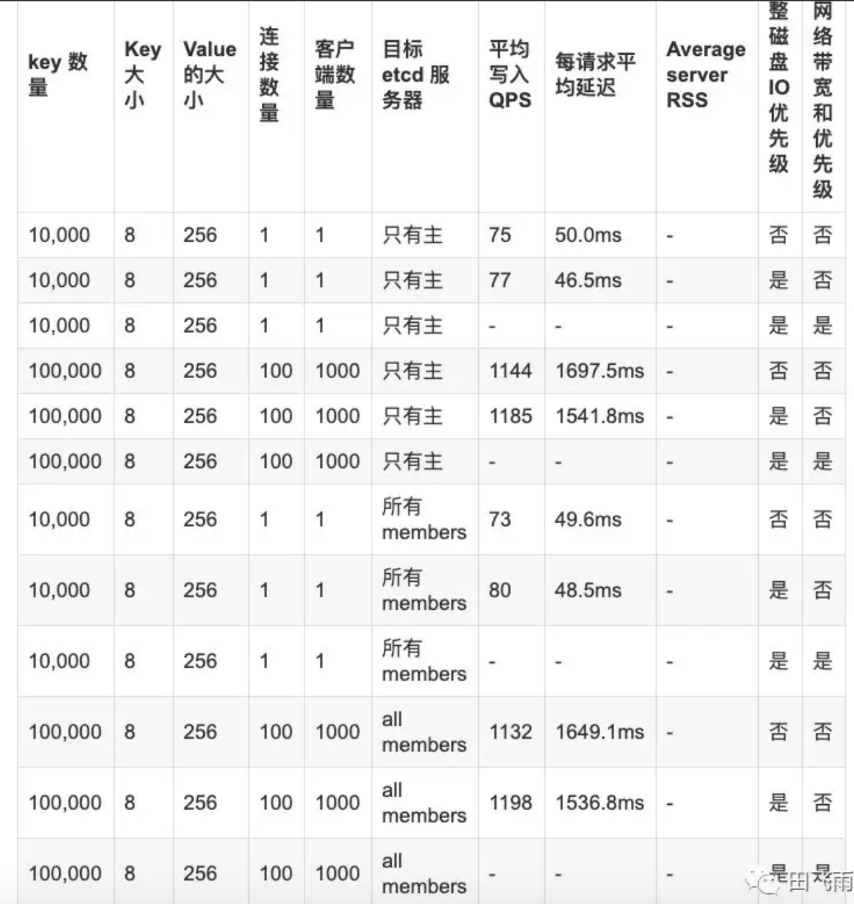

技术002KEtcd

-  `参数调优 <>`__

   -  `时间参数 <>`__
   -  `磁盘 <>`__
   -  `网络 <>`__
   -  `数据规模 <>`__

-  `性能测试 <>`__

   -  `写入测试 - etcd v3.3.10 <>`__
   -  `读取测试 - etcd v3.3.10 <>`__

-  `参考文献 <>`__

Round Trip Time /
RTT：完成一个etcd请求的最小时间是成员之间的网络往返时延

参数调优
========

时间参数
--------

-  第一个参数就是所谓的心跳间隔，即主节点通知从节点它还是领导者的频率。

实践数据表明，该参数应该设置成节点之间 RTT 的时间。Etcd 的心跳间隔默认是
100
毫秒。第二个参数是选举超时时间，即从节点等待多久没收到主节点的心跳就尝试去竞选领导者。Etcd
的选举超时时间默认是 1000 毫秒。

调整这些参数值是有条件的，此消波长。心跳间隔值推荐设置为临近节点间 RTT
的最大值，通常是 0.5~1.5 倍 RTT 值。如果心跳间隔设得太短，那么 Etcd
就会发送没必要的心跳信息，从而增加 CPU
和网络资源的消耗；如果设得太长，就会导致选举等待时间的超时。如果选举等待时间设置的过长，就会导致节点异常检测时间过长。评估
RTT 值的最简单的方法是使用 ping 的操作。

选举超时时间应该基于心跳间隔和节点之间的平均 RTT 值。选举超时必须至少是
RTT 10 倍的时间以便对网络波动。例如，如果 RTT 的值是 10
毫秒，那么选举超时时间必须至少是 100 毫秒。选举超时时间的上限是 50000
毫秒（50 秒），这个时间只能只用于全球范围内分布式部署的 Etcd
集群。美国大陆的一个 RTT 的合理时间大约是 130 毫秒，美国和日本的 RTT
大约是 350~400 毫秒。如果算上网络波动和重试的时间，那么 5 秒是一次全球
RTT 的安全上线。因为选举超时时间应该是心跳包广播时间的 10 倍，所以 50
秒的选举超时时间是全局分布式部署 Etcd 的合理上线值。

心跳间隔和选举超时时间的值对同一个 Etcd
集群的所有节点都生效，如果各个节点都不同的话，就会导致集群发生不可预知的不稳定性。Etcd
启动时通过传入启动参数或环境变量覆盖默认值，单位是毫秒。示例代码具体如下：

::

   $ etcd --heartbeat-interval=100 --election-timeout=500
   # 环境变量值
   $ ETCD_HEARTBEAT_INTERVAL=100 ETCD_ELECTION_TIMEOUT=500 etcd

磁盘
----

1. 可以考虑将 snap 与 wal 进行分盘，放在两块 SSD 盘上，提高整体的 IO
   效率，这种方式可以提升etcd 20%左右的性能。

2. etcd 集群对磁盘 I/O 的延时非常敏感，因为 Etcd
   必须持久化它的日志，当其他 I/O 密集型的进程也在占用磁盘 I/O
   的带宽时，就会导致 fsync 时延非常高。这将导致 Etcd
   丢失心跳包、请求超时或暂时性的 Leader 丢失。\ **这时可以适当为 Etcd
   服务赋予更高的磁盘 I/O 权限，让 Etcd 更稳定的运行。在 Linux
   系统中，磁盘 I/O 权限可以通过 ionice 命令进行调整。**

Linux 中 etcd 的磁盘优先级可以使用 ionice 配置：
``ionice -c2 -n0 -p``\ pgrep etcd`\`

网络
----

etcd 中比较复杂的是网络的调优，因此大量的网络请求会在 peer
节点之间转发，而且整体网络吞吐也很大，但是还是再次强调不建议大家调整系统参数，大家可以通过修改
etcd 的 –heartbeat-interval 与 –election-timeout
启动参数来适当提高高吞吐网络下 etcd
的集群鲁棒性，通常同步吞吐在100MB左右的集群可以考虑将
–heartbeat-interval 设置为 300ms-500ms，–election-timeout 可以设置在
5000ms 左右。此外官方还有基于 TC
的网络优先传输方案，也是一个比较适用的调优手段。

如果 etcd 的 Leader 服务大量并发客户端，这就会导致 follower
的请求的处理被延迟因为网络延迟。follower 的send
buffer中能看到错误的列表，如下所示：

::

   dropped MsgProp to 247ae21ff9436b2d since streamMsg's sending buffer is full

   dropped MsgAppResp to 247ae21ff9436b2d since streamMsg's sending buffer is full

这些错误可以通过提高 Leader 的网络优先级来提高 follower
的请求的响应。可以通过流量控制机制来提高:

::

   // 针对 2379、2380 端口放行
   $ tc qdisc add dev eth0 root handle 1: prio bands 3
   $ tc filter add dev eth0 parent 1: protocol ip prio 1 u32 match ip sport 2380 0xffff flowid 1:1
   $ tc filter add dev eth0 parent 1: protocol ip prio 1 u32 match ip dport 2380 0xffff flowid 1:1
   $ tc filter add dev eth0 parent 1: protocol ip prio 2 u32 match ip sport 2379 0xffff flowid 1:1
   $ tc filter add dev eth0 parent 1: protocol ip prio 2 u32 match ip dport 2379 0xffff flowid 1:1

   // 查看现有的队列
   $ tc -s qdisc ls dev enp0s8
   qdisc prio 1: root refcnt 2 bands 3 priomap  1 2 2 2 1 2 0 0 1 1 1 1 1 1 1 1
    Sent 258578 bytes 923 pkt (dropped 0, overlimits 0 requeues 0)
    backlog 0b 0p requeues 0

   // 删除队列
   $ tc qdisc del dev enp0s8 root

数据规模
--------

etcd 的硬盘存储上限（默认是 2GB）,当 etcd 数据量超过默认 quota
值后便不再接受写请求，可以通过设置 –quota-backend-bytes
参数来增加存储大小,quota-backend-bytes 默认值为 0，即使用默认 quota 为
2GB，上限值为 8 GB，具体说明可参考官方文档：dev-guide/limit.md。

性能测试
========

https://github.com/etcd-io/etcd/blob/master/Documentation/op-guide/performance.md

安装 etcd 压测工具 benchmark：
``go get go.etcd.io/etcd/tools/benchmark``

对于写入测试，按照官方文档的测试方法指定不同数量的客户端和连接数以及 key
的大小，对于读取操作，分别测试了线性化读取以及串行化读取，由于 etcd
是强一致性的，其默认读取测试就是线性化读取。

写入测试 - etcd v3.3.10
-----------------------

::

   // 查看 leader
   $ etcdctl member list

   // leader
   $ benchmark --endpoints="http://192.168.74.36:23791" --target-leader --conns=1 --clients=1 put --key-size=8 --sequential-keys --total=10000 --val-size=256

   $ benchmark --endpoints="http://192.168.74.36:23791" --target-leader --conns=100 --clients=1000 put --key-size=8 --sequential-keys --total=100000 --val-size=256

   // 所有 members
   $ benchmark --endpoints="http://192.168.74.36:23791,http://192.168.74.36:23792,http://192.168.74.36:23793" --target-leader --conns=1 --clients=1 put --key-size=8 --sequential-keys --total=10000 --val-size=256

   $ benchmark --endpoints="http://192.168.74.36:23791,http://192.168.74.36:23792,http://192.168.74.36:23793"  --target-leader --conns=100 --clients=1000 put --key-size=8 --sequential-keys --total=100000 --val-size=256

|image0|

读取测试 - etcd v3.3.10
-----------------------

::

   $ benchmark --endpoints="http://192.168.74.36:23791,http://192.168.74.36:23792,http://192.168.74.36:23793"  --conns=1 --clients=1  range foo --consistency=l --total=10000

   $ benchmark --endpoints="http://192.168.74.36:23791,http://192.168.74.36:23792,http://192.168.74.36:23793"  --conns=1 --clients=1  range foo --consistency=s --total=10000

   $ benchmark --endpoints="http://192.168.74.36:23791,http://192.168.74.36:23792,http://192.168.74.36:23793"  --conns=100 --clients=1000  range foo --consistency=l --total=100000

   $ benchmark --endpoints="http://192.168.74.36:23791,http://192.168.74.36:23792,http://192.168.74.36:23793"  --conns=100 --clients=1000  range foo --consistency=s --total=100000

|image1|

参考文献
========

`etcd
性能测试与调优 <https://mp.weixin.qq.com/s?__biz=MzAwNzcyMDY5Mg==&mid=2648900162&idx=1&sn=7539d8cb95e72d9b1aa1ad89b488bea6&scene=21#wechat_redirect>`__

%5BTOC%5D%0A%0A%0ARound%20Trip%20Time%20%2F%20RTT%EF%BC%9A%E5%AE%8C%E6%88%90%E4%B8%80%E4%B8%AAetcd%E8%AF%B7%E6%B1%82%E7%9A%84%E6%9C%80%E5%B0%8F%E6%97%B6%E9%97%B4%E6%98%AF%E6%88%90%E5%91%98%E4%B9%8B%E9%97%B4%E7%9A%84%E7%BD%91%E7%BB%9C%E5%BE%80%E8%BF%94%E6%97%B6%E5%BB%B6%0A%0A%0A%23%20%E5%8F%82%E6%95%B0%E8%B0%83%E4%BC%98%0A%23%23%20%E6%97%B6%E9%97%B4%E5%8F%82%E6%95%B0%0A-%20%E7%AC%AC%E4%B8%80%E4%B8%AA%E5%8F%82%E6%95%B0%E5%B0%B1%E6%98%AF%E6%89%80%E8%B0%93%E7%9A%84%E5%BF%83%E8%B7%B3%E9%97%B4%E9%9A%94%EF%BC%8C%E5%8D%B3%E4%B8%BB%E8%8A%82%E7%82%B9%E9%80%9A%E7%9F%A5%E4%BB%8E%E8%8A%82%E7%82%B9%E5%AE%83%E8%BF%98%E6%98%AF%E9%A2%86%E5%AF%BC%E8%80%85%E7%9A%84%E9%A2%91%E7%8E%87%E3%80%82%0A%0A%E5%AE%9E%E8%B7%B5%E6%95%B0%E6%8D%AE%E8%A1%A8%E6%98%8E%EF%BC%8C%E8%AF%A5%E5%8F%82%E6%95%B0%E5%BA%94%E8%AF%A5%E8%AE%BE%E7%BD%AE%E6%88%90%E8%8A%82%E7%82%B9%E4%B9%8B%E9%97%B4%20RTT%20%E7%9A%84%E6%97%B6%E9%97%B4%E3%80%82Etcd%20%E7%9A%84%E5%BF%83%E8%B7%B3%E9%97%B4%E9%9A%94%E9%BB%98%E8%AE%A4%E6%98%AF%20100%20%E6%AF%AB%E7%A7%92%E3%80%82%E7%AC%AC%E4%BA%8C%E4%B8%AA%E5%8F%82%E6%95%B0%E6%98%AF%E9%80%89%E4%B8%BE%E8%B6%85%E6%97%B6%E6%97%B6%E9%97%B4%EF%BC%8C%E5%8D%B3%E4%BB%8E%E8%8A%82%E7%82%B9%E7%AD%89%E5%BE%85%E5%A4%9A%E4%B9%85%E6%B2%A1%E6%94%B6%E5%88%B0%E4%B8%BB%E8%8A%82%E7%82%B9%E7%9A%84%E5%BF%83%E8%B7%B3%E5%B0%B1%E5%B0%9D%E8%AF%95%E5%8E%BB%E7%AB%9E%E9%80%89%E9%A2%86%E5%AF%BC%E8%80%85%E3%80%82Etcd%20%E7%9A%84%E9%80%89%E4%B8%BE%E8%B6%85%E6%97%B6%E6%97%B6%E9%97%B4%E9%BB%98%E8%AE%A4%E6%98%AF%201000%20%E6%AF%AB%E7%A7%92%E3%80%82%0A%0A%E8%B0%83%E6%95%B4%E8%BF%99%E4%BA%9B%E5%8F%82%E6%95%B0%E5%80%BC%E6%98%AF%E6%9C%89%E6%9D%A1%E4%BB%B6%E7%9A%84%EF%BC%8C%E6%AD%A4%E6%B6%88%E6%B3%A2%E9%95%BF%E3%80%82%E5%BF%83%E8%B7%B3%E9%97%B4%E9%9A%94%E5%80%BC%E6%8E%A8%E8%8D%90%E8%AE%BE%E7%BD%AE%E4%B8%BA%E4%B8%B4%E8%BF%91%E8%8A%82%E7%82%B9%E9%97%B4%20RTT%20%E7%9A%84%E6%9C%80%E5%A4%A7%E5%80%BC%EF%BC%8C%E9%80%9A%E5%B8%B8%E6%98%AF%200.5\ :sub:`1.5%20%E5%80%8D%20RTT%20%E5%80%BC%E3%80%82%E5%A6%82%E6%9E%9C%E5%BF%83%E8%B7%B3%E9%97%B4%E9%9A%94%E8%AE%BE%E5%BE%97%E5%A4%AA%E7%9F%AD%EF%BC%8C%E9%82%A3%E4%B9%88%20Etcd%20%E5%B0%B1%E4%BC%9A%E5%8F%91%E9%80%81%E6%B2%A1%E5%BF%85%E8%A6%81%E7%9A%84%E5%BF%83%E8%B7%B3%E4%BF%A1%E6%81%AF%EF%BC%8C%E4%BB%8E%E8%80%8C%E5%A2%9E%E5%8A%A0%20CPU%20%E5%92%8C%E7%BD%91%E7%BB%9C%E8%B5%84%E6%BA%90%E7%9A%84%E6%B6%88%E8%80%97%EF%BC%9B%E5%A6%82%E6%9E%9C%E8%AE%BE%E5%BE%97%E5%A4%AA%E9%95%BF%EF%BC%8C%E5%B0%B1%E4%BC%9A%E5%AF%BC%E8%87%B4%E9%80%89%E4%B8%BE%E7%AD%89%E5%BE%85%E6%97%B6%E9%97%B4%E7%9A%84%E8%B6%85%E6%97%B6%E3%80%82%E5%A6%82%E6%9E%9C%E9%80%89%E4%B8%BE%E7%AD%89%E5%BE%85%E6%97%B6%E9%97%B4%E8%AE%BE%E7%BD%AE%E7%9A%84%E8%BF%87%E9%95%BF%EF%BC%8C%E5%B0%B1%E4%BC%9A%E5%AF%BC%E8%87%B4%E8%8A%82%E7%82%B9%E5%BC%82%E5%B8%B8%E6%A3%80%E6%B5%8B%E6%97%B6%E9%97%B4%E8%BF%87%E9%95%BF%E3%80%82%E8%AF%84%E4%BC%B0%20RTT%20%E5%80%BC%E7%9A%84%E6%9C%80%E7%AE%80%E5%8D%95%E7%9A%84%E6%96%B9%E6%B3%95%E6%98%AF%E4%BD%BF%E7%94%A8%20ping%20%E7%9A%84%E6%93%8D%E4%BD%9C%E3%80%82%0A%0A%E9%80%89%E4%B8%BE%E8%B6%85%E6%97%B6%E6%97%B6%E9%97%B4%E5%BA%94%E8%AF%A5%E5%9F%BA%E4%BA%8E%E5%BF%83%E8%B7%B3%E9%97%B4%E9%9A%94%E5%92%8C%E8%8A%82%E7%82%B9%E4%B9%8B%E9%97%B4%E7%9A%84%E5%B9%B3%E5%9D%87%20RTT%20%E5%80%BC%E3%80%82%E9%80%89%E4%B8%BE%E8%B6%85%E6%97%B6%E5%BF%85%E9%A1%BB%E8%87%B3%E5%B0%91%E6%98%AF%20RTT%2010%20%E5%80%8D%E7%9A%84%E6%97%B6%E9%97%B4%E4%BB%A5%E4%BE%BF%E5%AF%B9%E7%BD%91%E7%BB%9C%E6%B3%A2%E5%8A%A8%E3%80%82%E4%BE%8B%E5%A6%82%EF%BC%8C%E5%A6%82%E6%9E%9C%20RTT%20%E7%9A%84%E5%80%BC%E6%98%AF%2010%20%E6%AF%AB%E7%A7%92%EF%BC%8C%E9%82%A3%E4%B9%88%E9%80%89%E4%B8%BE%E8%B6%85%E6%97%B6%E6%97%B6%E9%97%B4%E5%BF%85%E9%A1%BB%E8%87%B3%E5%B0%91%E6%98%AF%20100%20%E6%AF%AB%E7%A7%92%E3%80%82%E9%80%89%E4%B8%BE%E8%B6%85%E6%97%B6%E6%97%B6%E9%97%B4%E7%9A%84%E4%B8%8A%E9%99%90%E6%98%AF%2050000%20%E6%AF%AB%E7%A7%92%EF%BC%8850%20%E7%A7%92%EF%BC%89%EF%BC%8C%E8%BF%99%E4%B8%AA%E6%97%B6%E9%97%B4%E5%8F%AA%E8%83%BD%E5%8F%AA%E7%94%A8%E4%BA%8E%E5%85%A8%E7%90%83%E8%8C%83%E5%9B%B4%E5%86%85%E5%88%86%E5%B8%83%E5%BC%8F%E9%83%A8%E7%BD%B2%E7%9A%84%20Etcd%20%E9%9B%86%E7%BE%A4%E3%80%82%E7%BE%8E%E5%9B%BD%E5%A4%A7%E9%99%86%E7%9A%84%E4%B8%80%E4%B8%AA%20RTT%20%E7%9A%84%E5%90%88%E7%90%86%E6%97%B6%E9%97%B4%E5%A4%A7%E7%BA%A6%E6%98%AF%20130%20%E6%AF%AB%E7%A7%92%EF%BC%8C%E7%BE%8E%E5%9B%BD%E5%92%8C%E6%97%A5%E6%9C%AC%E7%9A%84%20RTT%20%E5%A4%A7%E7%BA%A6%E6%98%AF%20350`\ 400%20%E6%AF%AB%E7%A7%92%E3%80%82%E5%A6%82%E6%9E%9C%E7%AE%97%E4%B8%8A%E7%BD%91%E7%BB%9C%E6%B3%A2%E5%8A%A8%E5%92%8C%E9%87%8D%E8%AF%95%E7%9A%84%E6%97%B6%E9%97%B4%EF%BC%8C%E9%82%A3%E4%B9%88%205%20%E7%A7%92%E6%98%AF%E4%B8%80%E6%AC%A1%E5%85%A8%E7%90%83%20RTT%20%E7%9A%84%E5%AE%89%E5%85%A8%E4%B8%8A%E7%BA%BF%E3%80%82%E5%9B%A0%E4%B8%BA%E9%80%89%E4%B8%BE%E8%B6%85%E6%97%B6%E6%97%B6%E9%97%B4%E5%BA%94%E8%AF%A5%E6%98%AF%E5%BF%83%E8%B7%B3%E5%8C%85%E5%B9%BF%E6%92%AD%E6%97%B6%E9%97%B4%E7%9A%84%2010%20%E5%80%8D%EF%BC%8C%E6%89%80%E4%BB%A5%2050%20%E7%A7%92%E7%9A%84%E9%80%89%E4%B8%BE%E8%B6%85%E6%97%B6%E6%97%B6%E9%97%B4%E6%98%AF%E5%85%A8%E5%B1%80%E5%88%86%E5%B8%83%E5%BC%8F%E9%83%A8%E7%BD%B2%20Etcd%20%E7%9A%84%E5%90%88%E7%90%86%E4%B8%8A%E7%BA%BF%E5%80%BC%E3%80%82%0A%0A%E5%BF%83%E8%B7%B3%E9%97%B4%E9%9A%94%E5%92%8C%E9%80%89%E4%B8%BE%E8%B6%85%E6%97%B6%E6%97%B6%E9%97%B4%E7%9A%84%E5%80%BC%E5%AF%B9%E5%90%8C%E4%B8%80%E4%B8%AA%20Etcd%20%E9%9B%86%E7%BE%A4%E7%9A%84%E6%89%80%E6%9C%89%E8%8A%82%E7%82%B9%E9%83%BD%E7%94%9F%E6%95%88%EF%BC%8C%E5%A6%82%E6%9E%9C%E5%90%84%E4%B8%AA%E8%8A%82%E7%82%B9%E9%83%BD%E4%B8%8D%E5%90%8C%E7%9A%84%E8%AF%9D%EF%BC%8C%E5%B0%B1%E4%BC%9A%E5%AF%BC%E8%87%B4%E9%9B%86%E7%BE%A4%E5%8F%91%E7%94%9F%E4%B8%8D%E5%8F%AF%E9%A2%84%E7%9F%A5%E7%9A%84%E4%B8%8D%E7%A8%B3%E5%AE%9A%E6%80%A7%E3%80%82Etcd%20%E5%90%AF%E5%8A%A8%E6%97%B6%E9%80%9A%E8%BF%87%E4%BC%A0%E5%85%A5%E5%90%AF%E5%8A%A8%E5%8F%82%E6%95%B0%E6%88%96%E7%8E%AF%E5%A2%83%E5%8F%98%E9%87%8F%E8%A6%86%E7%9B%96%E9%BB%98%E8%AE%A4%E5%80%BC%EF%BC%8C%E5%8D%95%E4%BD%8D%E6%98%AF%E6%AF%AB%E7%A7%92%E3%80%82%E7%A4%BA%E4%BE%8B%E4%BB%A3%E7%A0%81%E5%85%B7%E4%BD%93%E5%A6%82%E4%B8%8B%EF%BC%9A%0A%0A%60%60%60%0A%24%20etcd%20–heartbeat-interval%3D100%20–election-timeout%3D500%0A%23%20%E7%8E%AF%E5%A2%83%E5%8F%98%E9%87%8F%E5%80%BC%0A%24%20ETCD_HEARTBEAT_INTERVAL%3D100%20ETCD_ELECTION_TIMEOUT%3D500%20etcd%0A%60%60%60%0A%0A%23%23%20%E7%A3%81%E7%9B%98%0A%0A1.%20%E5%8F%AF%E4%BB%A5%E8%80%83%E8%99%91%E5%B0%86%20snap%20%E4%B8%8E%20wal%20%E8%BF%9B%E8%A1%8C%E5%88%86%E7%9B%98%EF%BC%8C%E6%94%BE%E5%9C%A8%E4%B8%A4%E5%9D%97%20SSD%20%E7%9B%98%E4%B8%8A%EF%BC%8C%E6%8F%90%E9%AB%98%E6%95%B4%E4%BD%93%E7%9A%84%20IO%20%E6%95%88%E7%8E%87%EF%BC%8C%E8%BF%99%E7%A7%8D%E6%96%B9%E5%BC%8F%E5%8F%AF%E4%BB%A5%E6%8F%90%E5%8D%87etcd%2020%25%E5%B7%A6%E5%8F%B3%E7%9A%84%E6%80%A7%E8%83%BD%E3%80%82%0A2.%20etcd%20%E9%9B%86%E7%BE%A4%E5%AF%B9%E7%A3%81%E7%9B%98%20I%2FO%20%E7%9A%84%E5%BB%B6%E6%97%B6%E9%9D%9E%E5%B8%B8%E6%95%8F%E6%84%9F%EF%BC%8C%E5%9B%A0%E4%B8%BA%20Etcd%20%E5%BF%85%E9%A1%BB%E6%8C%81%E4%B9%85%E5%8C%96%E5%AE%83%E7%9A%84%E6%97%A5%E5%BF%97%EF%BC%8C%E5%BD%93%E5%85%B6%E4%BB%96%20I%2FO%20%E5%AF%86%E9%9B%86%E5%9E%8B%E7%9A%84%E8%BF%9B%E7%A8%8B%E4%B9%9F%E5%9C%A8%E5%8D%A0%E7%94%A8%E7%A3%81%E7%9B%98%20I%2FO%20%E7%9A%84%E5%B8%A6%E5%AE%BD%E6%97%B6%EF%BC%8C%E5%B0%B1%E4%BC%9A%E5%AF%BC%E8%87%B4%20fsync%20%E6%97%B6%E5%BB%B6%E9%9D%9E%E5%B8%B8%E9%AB%98%E3%80%82%E8%BF%99%E5%B0%86%E5%AF%BC%E8%87%B4%20Etcd%20%E4%B8%A2%E5%A4%B1%E5%BF%83%E8%B7%B3%E5%8C%85%E3%80%81%E8%AF%B7%E6%B1%82%E8%B6%85%E6%97%B6%E6%88%96%E6%9A%82%E6%97%B6%E6%80%A7%E7%9A%84%20Leader%20%E4%B8%A2%E5%A4%B1%E3%80%82\ **%E8%BF%99%E6%97%B6%E5%8F%AF%E4%BB%A5%E9%80%82%E5%BD%93%E4%B8%BA%20Etcd%20%E6%9C%8D%E5%8A%A1%E8%B5%8B%E4%BA%88%E6%9B%B4%E9%AB%98%E7%9A%84%E7%A3%81%E7%9B%98%20I%2FO%20%E6%9D%83%E9%99%90%EF%BC%8C%E8%AE%A9%20Etcd%20%E6%9B%B4%E7%A8%B3%E5%AE%9A%E7%9A%84%E8%BF%90%E8%A1%8C%E3%80%82%E5%9C%A8%20Linux%20%E7%B3%BB%E7%BB%9F%E4%B8%AD%EF%BC%8C%E7%A3%81%E7%9B%98%20I%2FO%20%E6%9D%83%E9%99%90%E5%8F%AF%E4%BB%A5%E9%80%9A%E8%BF%87%20ionice%20%E5%91%BD%E4%BB%A4%E8%BF%9B%E8%A1%8C%E8%B0%83%E6%95%B4%E3%80%82**\ %0ALinux%20%E4%B8%AD%20etcd%20%20%E7%9A%84%E7%A3%81%E7%9B%98%E4%BC%98%E5%85%88%E7%BA%A7%E5%8F%AF%E4%BB%A5%E4%BD%BF%E7%94%A8%20ionice%20%E9%85%8D%E7%BD%AE%EF%BC%9A%0A%60ionice%20-c2%20-n0%20-p%20%60pgrep%20etcd%60%60%0A%0A%0A%0A%23%23%20%E7%BD%91%E7%BB%9C%0Aetcd%20%E4%B8%AD%E6%AF%94%E8%BE%83%E5%A4%8D%E6%9D%82%E7%9A%84%E6%98%AF%E7%BD%91%E7%BB%9C%E7%9A%84%E8%B0%83%E4%BC%98%EF%BC%8C%E5%9B%A0%E6%AD%A4%E5%A4%A7%E9%87%8F%E7%9A%84%E7%BD%91%E7%BB%9C%E8%AF%B7%E6%B1%82%E4%BC%9A%E5%9C%A8%20peer%20%E8%8A%82%E7%82%B9%E4%B9%8B%E9%97%B4%E8%BD%AC%E5%8F%91%EF%BC%8C%E8%80%8C%E4%B8%94%E6%95%B4%E4%BD%93%E7%BD%91%E7%BB%9C%E5%90%9E%E5%90%90%E4%B9%9F%E5%BE%88%E5%A4%A7%EF%BC%8C%E4%BD%86%E6%98%AF%E8%BF%98%E6%98%AF%E5%86%8D%E6%AC%A1%E5%BC%BA%E8%B0%83%E4%B8%8D%E5%BB%BA%E8%AE%AE%E5%A4%A7%E5%AE%B6%E8%B0%83%E6%95%B4%E7%B3%BB%E7%BB%9F%E5%8F%82%E6%95%B0%EF%BC%8C%E5%A4%A7%E5%AE%B6%E5%8F%AF%E4%BB%A5%E9%80%9A%E8%BF%87%E4%BF%AE%E6%94%B9%20etcd%20%E7%9A%84%20–heartbeat-interval%20%E4%B8%8E%20–election-timeout%20%E5%90%AF%E5%8A%A8%E5%8F%82%E6%95%B0%E6%9D%A5%E9%80%82%E5%BD%93%E6%8F%90%E9%AB%98%E9%AB%98%E5%90%9E%E5%90%90%E7%BD%91%E7%BB%9C%E4%B8%8B%20etcd%20%E7%9A%84%E9%9B%86%E7%BE%A4%E9%B2%81%E6%A3%92%E6%80%A7%EF%BC%8C%E9%80%9A%E5%B8%B8%E5%90%8C%E6%AD%A5%E5%90%9E%E5%90%90%E5%9C%A8100MB%E5%B7%A6%E5%8F%B3%E7%9A%84%E9%9B%86%E7%BE%A4%E5%8F%AF%E4%BB%A5%E8%80%83%E8%99%91%E5%B0%86%20–heartbeat-interval%20%E8%AE%BE%E7%BD%AE%E4%B8%BA%20300ms-500ms%EF%BC%8C–election-timeout%20%E5%8F%AF%E4%BB%A5%E8%AE%BE%E7%BD%AE%E5%9C%A8%205000ms%20%E5%B7%A6%E5%8F%B3%E3%80%82%E6%AD%A4%E5%A4%96%E5%AE%98%E6%96%B9%E8%BF%98%E6%9C%89%E5%9F%BA%E4%BA%8E%20TC%20%E7%9A%84%E7%BD%91%E7%BB%9C%E4%BC%98%E5%85%88%E4%BC%A0%E8%BE%93%E6%96%B9%E6%A1%88%EF%BC%8C%E4%B9%9F%E6%98%AF%E4%B8%80%E4%B8%AA%E6%AF%94%E8%BE%83%E9%80%82%E7%94%A8%E7%9A%84%E8%B0%83%E4%BC%98%E6%89%8B%E6%AE%B5%E3%80%82%0A%0A%E5%A6%82%E6%9E%9C%20etcd%20%E7%9A%84%20Leader%20%E6%9C%8D%E5%8A%A1%E5%A4%A7%E9%87%8F%E5%B9%B6%E5%8F%91%E5%AE%A2%E6%88%B7%E7%AB%AF%EF%BC%8C%E8%BF%99%E5%B0%B1%E4%BC%9A%E5%AF%BC%E8%87%B4%20follower%20%E7%9A%84%E8%AF%B7%E6%B1%82%E7%9A%84%E5%A4%84%E7%90%86%E8%A2%AB%E5%BB%B6%E8%BF%9F%E5%9B%A0%E4%B8%BA%E7%BD%91%E7%BB%9C%E5%BB%B6%E8%BF%9F%E3%80%82follower%20%E7%9A%84send%20buffer%E4%B8%AD%E8%83%BD%E7%9C%8B%E5%88%B0%E9%94%99%E8%AF%AF%E7%9A%84%E5%88%97%E8%A1%A8%EF%BC%8C%E5%A6%82%E4%B8%8B%E6%89%80%E7%A4%BA%EF%BC%9A%0A%0A%60%60%60%0Adropped%20MsgProp%20to%20247ae21ff9436b2d%20since%20streamMsg’s%20sending%20buffer%20is%20full%0A%0Adropped%20MsgAppResp%20to%20247ae21ff9436b2d%20since%20streamMsg’s%20sending%20buffer%20is%20full%0A%60%60%60%0A%E8%BF%99%E4%BA%9B%E9%94%99%E8%AF%AF%E5%8F%AF%E4%BB%A5%E9%80%9A%E8%BF%87%E6%8F%90%E9%AB%98%20Leader%20%E7%9A%84%E7%BD%91%E7%BB%9C%E4%BC%98%E5%85%88%E7%BA%A7%E6%9D%A5%E6%8F%90%E9%AB%98%20follower%20%E7%9A%84%E8%AF%B7%E6%B1%82%E7%9A%84%E5%93%8D%E5%BA%94%E3%80%82%E5%8F%AF%E4%BB%A5%E9%80%9A%E8%BF%87%E6%B5%81%E9%87%8F%E6%8E%A7%E5%88%B6%E6%9C%BA%E5%88%B6%E6%9D%A5%E6%8F%90%E9%AB%98%3A%0A%0A%60%60%60%0A%2F%2F%20%E9%92%88%E5%AF%B9%202379%E3%80%812380%20%E7%AB%AF%E5%8F%A3%E6%94%BE%E8%A1%8C%0A%24%20tc%20qdisc%20add%20dev%20eth0%20root%20handle%201%3A%20prio%20bands%203%0A%24%20tc%20filter%20add%20dev%20eth0%20parent%201%3A%20protocol%20ip%20prio%201%20u32%20match%20ip%20sport%202380%200xffff%20flowid%201%3A1%0A%24%20tc%20filter%20add%20dev%20eth0%20parent%201%3A%20protocol%20ip%20prio%201%20u32%20match%20ip%20dport%202380%200xffff%20flowid%201%3A1%0A%24%20tc%20filter%20add%20dev%20eth0%20parent%201%3A%20protocol%20ip%20prio%202%20u32%20match%20ip%20sport%202379%200xffff%20flowid%201%3A1%0A%24%20tc%20filter%20add%20dev%20eth0%20parent%201%3A%20protocol%20ip%20prio%202%20u32%20match%20ip%20dport%202379%200xffff%20flowid%201%3A1%0A%0A%2F%2F%20%E6%9F%A5%E7%9C%8B%E7%8E%B0%E6%9C%89%E7%9A%84%E9%98%9F%E5%88%97%0A%24%20tc%20-s%20qdisc%20ls%20dev%20enp0s8%0Aqdisc%20prio%201%3A%20root%20refcnt%202%20bands%203%20priomap%20%201%202%202%202%201%202%200%200%201%201%201%201%201%201%201%201%0A%20Sent%20258578%20bytes%20923%20pkt%20(dropped%200%2C%20overlimits%200%20requeues%200)%0A%20backlog%200b%200p%20requeues%200%0A%0A%0A%2F%2F%20%E5%88%A0%E9%99%A4%E9%98%9F%E5%88%97%0A%24%20tc%20qdisc%20del%20dev%20enp0s8%20root%20%0A%0A%60%60%60%0A%0A%23%23%20%E6%95%B0%E6%8D%AE%E8%A7%84%E6%A8%A1%0Aetcd%20%E7%9A%84%E7%A1%AC%E7%9B%98%E5%AD%98%E5%82%A8%E4%B8%8A%E9%99%90%EF%BC%88%E9%BB%98%E8%AE%A4%E6%98%AF%202GB%EF%BC%89%2C%E5%BD%93%20etcd%20%E6%95%B0%E6%8D%AE%E9%87%8F%E8%B6%85%E8%BF%87%E9%BB%98%E8%AE%A4%20quota%20%E5%80%BC%E5%90%8E%E4%BE%BF%E4%B8%8D%E5%86%8D%E6%8E%A5%E5%8F%97%E5%86%99%E8%AF%B7%E6%B1%82%EF%BC%8C%E5%8F%AF%E4%BB%A5%E9%80%9A%E8%BF%87%E8%AE%BE%E7%BD%AE%20–quota-backend-bytes%20%E5%8F%82%E6%95%B0%E6%9D%A5%E5%A2%9E%E5%8A%A0%E5%AD%98%E5%82%A8%E5%A4%A7%E5%B0%8F%2Cquota-backend-bytes%20%E9%BB%98%E8%AE%A4%E5%80%BC%E4%B8%BA%200%EF%BC%8C%E5%8D%B3%E4%BD%BF%E7%94%A8%E9%BB%98%E8%AE%A4%20quota%20%E4%B8%BA%202GB%EF%BC%8C%E4%B8%8A%E9%99%90%E5%80%BC%E4%B8%BA%208%20GB%EF%BC%8C%E5%85%B7%E4%BD%93%E8%AF%B4%E6%98%8E%E5%8F%AF%E5%8F%82%E8%80%83%E5%AE%98%E6%96%B9%E6%96%87%E6%A1%A3%EF%BC%9Adev-guide%2Flimit.md%E3%80%82%0A%0A%0A%23%20%E6%80%A7%E8%83%BD%E6%B5%8B%E8%AF%95%0Ahttps%3A%2F%2Fgithub.com%2Fetcd-io%2Fetcd%2Fblob%2Fmaster%2FDocumentation%2Fop-guide%2Fperformance.md%0A%E5%AE%89%E8%A3%85%20etcd%20%E5%8E%8B%E6%B5%8B%E5%B7%A5%E5%85%B7%20benchmark%EF%BC%9A%0A%60go%20get%20go.etcd.io%2Fetcd%2Ftools%2Fbenchmark%60%0A%0A%E5%AF%B9%E4%BA%8E%E5%86%99%E5%85%A5%E6%B5%8B%E8%AF%95%EF%BC%8C%E6%8C%89%E7%85%A7%E5%AE%98%E6%96%B9%E6%96%87%E6%A1%A3%E7%9A%84%E6%B5%8B%E8%AF%95%E6%96%B9%E6%B3%95%E6%8C%87%E5%AE%9A%E4%B8%8D%E5%90%8C%E6%95%B0%E9%87%8F%E7%9A%84%E5%AE%A2%E6%88%B7%E7%AB%AF%E5%92%8C%E8%BF%9E%E6%8E%A5%E6%95%B0%E4%BB%A5%E5%8F%8A%20key%20%E7%9A%84%E5%A4%A7%E5%B0%8F%EF%BC%8C%E5%AF%B9%E4%BA%8E%E8%AF%BB%E5%8F%96%E6%93%8D%E4%BD%9C%EF%BC%8C%E5%88%86%E5%88%AB%E6%B5%8B%E8%AF%95%E4%BA%86%E7%BA%BF%E6%80%A7%E5%8C%96%E8%AF%BB%E5%8F%96%E4%BB%A5%E5%8F%8A%E4%B8%B2%E8%A1%8C%E5%8C%96%E8%AF%BB%E5%8F%96%EF%BC%8C%E7%94%B1%E4%BA%8E%20etcd%20%E6%98%AF%E5%BC%BA%E4%B8%80%E8%87%B4%E6%80%A7%E7%9A%84%EF%BC%8C%E5%85%B6%E9%BB%98%E8%AE%A4%E8%AF%BB%E5%8F%96%E6%B5%8B%E8%AF%95%E5%B0%B1%E6%98%AF%E7%BA%BF%E6%80%A7%E5%8C%96%E8%AF%BB%E5%8F%96%E3%80%82%0A%0A%23%23%20%E5%86%99%E5%85%A5%E6%B5%8B%E8%AF%95%20-%20etcd%20v3.3.10%0A%60%60%60%0A%2F%2F%20%E6%9F%A5%E7%9C%8B%20leader%20%0A%24%20etcdctl%20member%20list%0A%0A%2F%2F%20leader%0A%24%20benchmark%20–endpoints%3D%22http%3A%2F%2F192.168.74.36%3A23791%22%20–target-leader%20–conns%3D1%20–clients%3D1%20put%20–key-size%3D8%20–sequential-keys%20–total%3D10000%20–val-size%3D256%0A%0A%24%20benchmark%20–endpoints%3D%22http%3A%2F%2F192.168.74.36%3A23791%22%20–target-leader%20–conns%3D100%20–clients%3D1000%20put%20–key-size%3D8%20–sequential-keys%20–total%3D100000%20–val-size%3D256%0A%0A%0A%2F%2F%20%E6%89%80%E6%9C%89%20members%20%0A%24%20benchmark%20–endpoints%3D%22http%3A%2F%2F192.168.74.36%3A23791%2Chttp%3A%2F%2F192.168.74.36%3A23792%2Chttp%3A%2F%2F192.168.74.36%3A23793%22%20–target-leader%20–conns%3D1%20–clients%3D1%20put%20–key-size%3D8%20–sequential-keys%20–total%3D10000%20–val-size%3D256%0A%0A%24%20benchmark%20–endpoints%3D%22http%3A%2F%2F192.168.74.36%3A23791%2Chttp%3A%2F%2F192.168.74.36%3A23792%2Chttp%3A%2F%2F192.168.74.36%3A23793%22%20%20–target-leader%20–conns%3D100%20–clients%3D1000%20put%20–key-size%3D8%20–sequential-keys%20–total%3D100000%20–val-size%3D256%0A%60%60%60%0A%0A!%5B0e81e4fafe6578f75e656b5cfb6d1f51.png%5D(evernotecid%3A%2F%2F48E6E93E-A436-4E8F-9B4B-205CB9D86842%2Fappyinxiangcom%2F23555478%2FENResource%2Fp863)%0A%0A%23%23%20%E8%AF%BB%E5%8F%96%E6%B5%8B%E8%AF%95%20-%20etcd%20v3.3.10%0A%60%60%60%0A%24%20benchmark%20–endpoints%3D%22http%3A%2F%2F192.168.74.36%3A23791%2Chttp%3A%2F%2F192.168.74.36%3A23792%2Chttp%3A%2F%2F192.168.74.36%3A23793%22%20%20–conns%3D1%20–clients%3D1%20%20range%20foo%20–consistency%3Dl%20–total%3D10000%0A%0A%24%20benchmark%20–endpoints%3D%22http%3A%2F%2F192.168.74.36%3A23791%2Chttp%3A%2F%2F192.168.74.36%3A23792%2Chttp%3A%2F%2F192.168.74.36%3A23793%22%20%20–conns%3D1%20–clients%3D1%20%20range%20foo%20–consistency%3Ds%20–total%3D10000%0A%0A%24%20benchmark%20–endpoints%3D%22http%3A%2F%2F192.168.74.36%3A23791%2Chttp%3A%2F%2F192.168.74.36%3A23792%2Chttp%3A%2F%2F192.168.74.36%3A23793%22%20%20–conns%3D100%20–clients%3D1000%20%20range%20foo%20–consistency%3Dl%20–total%3D100000%0A%0A%24%20benchmark%20–endpoints%3D%22http%3A%2F%2F192.168.74.36%3A23791%2Chttp%3A%2F%2F192.168.74.36%3A23792%2Chttp%3A%2F%2F192.168.74.36%3A23793%22%20%20–conns%3D100%20–clients%3D1000%20%20range%20foo%20–consistency%3Ds%20–total%3D100000%0A%60%60%60%0A!%5B4c7837748216145c25a8f83bb44e0cc5.png%5D(evernotecid%3A%2F%2F48E6E93E-A436-4E8F-9B4B-205CB9D86842%2Fappyinxiangcom%2F23555478%2FENResource%2Fp864)%0A%0A%0A%0A%0A%23%20%E5%8F%82%E8%80%83%E6%96%87%E7%8C%AE%0A%5Betcd%20%E6%80%A7%E8%83%BD%E6%B5%8B%E8%AF%95%E4%B8%8E%E8%B0%83%E4%BC%98%5D(https%3A%2F%2Fmp.weixin.qq.com%2Fs%3F__biz%3DMzAwNzcyMDY5Mg%3D%3D%26mid%3D2648900162%26idx%3D1%26sn%3D7539d8cb95e72d9b1aa1ad89b488bea6%26scene%3D21%23wechat_redirect)

.. |image1| image:: ../_resources/4c7837748216145c25a8f83bb44e0cc5.png
