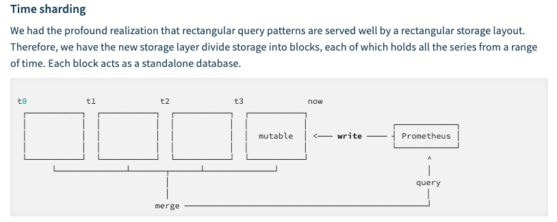

技术002KPromethus

-  `参数解读&存储实现原理 <>`__
-  `容量规划 <>`__
-  `高可用 <>`__
-  `报警 <>`__

   -  `钉钉 <>`__

-  `Trouble <>`__
-  `参考资料 <>`__

参数解读&存储实现原理
=====================

1. Time sharding |image0|
2. Index 将指标拆分成倒排索引（inverted index concept） 倒排索引
   |image1|
3. 监控数据在磁盘的存储形式

Prometheus
按照两个小时为一个时间窗口，将两小时内产生的数据存储在一个块（Block）中。每个块都是一个单独的目录，里面含该时间窗口内的所有样本数据（chunks），元数据文件（meta.json）以及索引文件（index）。其中索引文件会将指标名称和标签索引到样板数据的时间序列中。此期间如果通过
API 删除时间序列，删除记录会保存在单独的逻辑文件 tombstone 当中。

当前样本数据所在的块会被直接保存在内存中，不会持久化到磁盘中。为了确保
Prometheus 发生崩溃或重启时能够恢复数据，Prometheus
启动时会通过预写日志（write-ahead-log(WAL)）重新记录，从而恢复数据。预写日志文件保存在
wal 目录中，每个文件大小为 128MB。wal
文件包括还没有被压缩的原始数据，所以比常规的块文件大得多。一般情况下，Prometheus
会保留三个 wal
文件，但如果有些高负载服务器需要保存两个小时以上的原始数据，wal
文件的数量就会大于 3 个。

最初两个小时的块最终会在后台被压缩成更长的块。 [info] 注意

本地存储不可复制，无法构建集群，如果本地磁盘或节点出现故障，存储将无法扩展和迁移。因此我们只能把本地存储视为近期数据的短暂滑动窗口。如果你对数据持久化的要求不是很严格，可以使用本地磁盘存储多达数年的数据。

4. prlimit调整prometheus的fd数目

容量规划
========

抓取间隔越大，数据越稀疏；抓取间隔越小，监控数据的时间分辨率越高，但所需的存储资源会增多。建议将该值设置在
5s ~ 15s 之间。 1.{{}}可以取自定义的变量,$取环境变量
2.rule的语法检测步骤 go get
github.com/prometheus/prometheus/cmd/promtool promtool check rules
/path/to/example.rules. 3.query curl promql

curl -s
http://10.120.16.13:9090/api/v1/query?query=container_cpu_usage_seconds_total
\| jq

curl http://10.120.16.13:9090/api/v1/targets显示默认的label

https://prometheus.io/docs/prometheus/latest/querying/api/#expression-query-result-formats
通过api来获取prom相关数据信息

4，prom的一些命令参数 从2.0开始
–web.enable-lifecycle允许动态加载prom的配置 if o.EnableLifecycle {
router.Post(“/-/quit”, h.quit) router.Put(“/-/quit”, h.quit)
router.Post(“/-/reload”, h.reload) router.Put(“/-/reload”, h.reload) }
func (h *Handler) quit(w http.ResponseWriter, r*\ http.Request) {
fmt.Fprintf(w, “Requesting termination… Goodbye!”) close(h.quitCh) }
func (h *Handler) reload(w http.ResponseWriter, r*\ http.Request) { rc
:= make(chan error) h.reloadCh <- rc if err := <-rc; err != nil {

http.Error(w, fmt.Sprintf(“failed to reload config: %s”, err),
http.StatusInternalServerError)

} } 5..prometheus
需要两个接口做join操作，可以通过on同一个字段，group_right引入新的字段来实现。
https://github.com/prometheus/prometheus/issues/2670

https://medium.com/@amimahloof/kubernetes-promql-prometheus-cpu-aggregation-walkthrough-2c6fd2f941eb

最终实现公式如下所示：

max(kube_pod_info{namespace=“*n\ *\ **a**\ *\ m\ *\ **e**\ *\ s\ *\ **p**\ *\ a\ *\ **c**\ *\ e*”,\ *p\ *\ **o**\ *\ d*\ = “pod”})
by (namespace,pod,pod_ip) \* on(pod)

group_right(pod_ip) label_replace(

(sum(rate(container_cpu_usage_seconds_total{namespace=“*n\ *\ **a**\ *\ m\ *\ **e**\ *\ s\ *\ **p**\ *\ a\ *\ **c**\ *\ e*”,\ *p\ *\ **o**\ *\ d\ *\ **n\ ​\ a**\ *\ m\ *\ **e\ = “pod”,
container!=“filebeat”}[1m])) by (pod_name)) /
(sum(container_spec_cpu_quota{namespace=“*n\ *\ **a**\ *\ m\ *\ **e**\ *\ s\ *\ **p**\ *\ a\ *\ **c**\ *\ e*”,\ p**\ *\ o\ *\ **d**\ *\ n*\ ​\ *a\ *\ **m**\ *\ e*\ = “pod”,
container!=“filebeat”}) by (pod_name)
/100000)\ *100,“pod”,“1”,“pod_name”,“(.+)”)
max(kube_pod_info{namespace=“namespace”, pod=~“pod”}) by
(namespace,pod,pod_ip)* on(pod) group_right(pod_ip) label_replace(
(sum(container_memory_rss{namespace=“namespace”, pod_name=~“pod”,
container!=“filebeat”}) by(pod_name) /
sum(container_spec_memory_limit_bytes{namespace=“namespace”,
pod_name=~“$pod”, container!=“filebeat”}) by(pod_name) \*
100),“pod”,“$1”,“pod_name”,“(.+)”)

max(kube_pod_info{namespace=“*n\ *\ **a**\ *\ m\ *\ **e**\ *\ s\ *\ **p**\ *\ a\ *\ **c**\ *\ e*”,\ *p\ *\ **o**\ *\ d*\ = “pod”})
by (namespace,pod,pod_ip) \* on(pod)

group_right(pod_ip) label_replace(

rate(container_network_receive_bytes_total{namespace=“*n\ *\ **a**\ *\ m\ *\ **e**\ *\ s\ *\ **p**\ *\ a\ *\ **c**\ *\ e*”,*p\ **o**\ d\ **n\ ​\ a**\ m**e*= “pod”}[1m]),“pod”,“$1”,“pod_name”,“(.+)”)

max(kube_pod_info{namespace=“*n\ *\ **a**\ *\ m\ *\ **e**\ *\ s\ *\ **p**\ *\ a\ *\ **c**\ *\ e*”,\ *p\ *\ **o**\ *\ d*\ = “pod”})
by (namespace,pod,pod_ip) \* on(pod)

group_right(pod_ip) label_replace(

sum(kube_pod_container_resource_limits_cpu_cores{namespace=“*n\ *\ **a**\ *\ m\ *\ **e**\ *\ s\ *\ **p**\ *\ a\ *\ **c**\ *\ e*”,\ *p\ *\ **o**\ *\ d*\ = “pod”,
container!=“filebeat”}) by (pod),“pod”,“$1”,“pod_name”,“(.+)”)

max(kube_pod_info{namespace=“*n\ *\ **a**\ *\ m\ *\ **e**\ *\ s\ *\ **p**\ *\ a\ *\ **c**\ *\ e*”,\ *p\ *\ **o**\ *\ d*\ = “pod”})
by (namespace,pod,pod_ip) \* on(pod)

group_right(pod_ip) label_replace(

sum(kube_pod_container_resource_limits_memory_bytes{namespace=“*n\ *\ **a**\ *\ m\ *\ **e**\ *\ s\ *\ **p**\ *\ a\ *\ **c**\ *\ e*”,\ *p\ *\ **o**\ *\ d*\ = “pod”,
container!=“filebeat”}) by (pod),“pod”,“$1”,“pod_name”,“(.+)”)

指标存放位置 kube

container_cpu_usage_seconds_total{container_name=“POD”,cpu=“total”,,image=“docker2.yidian.com:5000/devops/pause:3.1”,instance=“10.126.53.9”,job=“kubernetes-cadvisor”,name=“k8s_POD_online-feedback-receiver-prod-1-d468dc8c8-9hjh4_dataplatform_033bc899-d2dc-11e9-82c1-1402ec8225a4_0”,namespace=“dataplatform”,pod_name=“online-feedback-receiver-prod-1-d468dc8c8-9hjh4”}

container_name等于POD的是pause容器

高可用
======

https://ylzheng.com/2018/03/17/promethues-ha-deploy/

报警
====

钉钉
----

./prometheus-webhook-dingtalk
–ding.profile=‘webhook1=https://oapi.dingtalk.com/robot/send?access_token=89066027a7c9f112ac9ecb21d716d9a1bd000b3cc42a19453467373593fdfe49’

``curl -l -H "Content-type: application/json" -X POST -d '{"msgtype":"markdown","markdown":{"title":"title","text":"text\n> 监控描述信息\n\n> ###### 告警时间 \n"},"at":{"atMobiles":["18811756877"],"isAtAll":true}}' https://oapi.dingtalk.com/robot/send?access_token=89066027a7c9f112ac9ecb21d716d9a1bd000b3cc42a19453467373593fdfe49 curl 'https://oapi.dingtalk.com/robot/send?access_token=89066027a7c9f112ac9ecb21d716d9a1bd000b3cc42a19453467373593fdfe49' \ -H 'Content-Type: application/json' \ -d '{ "msgtype": "text", "text": { "content": "我就是我, 是不一样的烟火" }, "at": { "atMobiles": [ "18811756877" ], "isAtAll": false } }'``

docker run -p 8060:8060 timonwong/prometheus-webhook-dingtalk:latest
/bin/prometheus-webhook-dingtalk
–ding.profile=‘webhook1=https://oapi.dingtalk.com/robot/send?access_token=89066027a7c9f112ac9ecb21d716d9a1bd000b3cc42a19453467373593fdfe49’

Trouble
=======

promethus内存异常

promethus的的内存消耗大概60G左右，物理机的内存是64G，影响了物理机上的其他业务，平时占用内存就是5.4G，导致内存增加的原因是因为调用remote
write写，remote write提示Error sending samples to remote storage"
count=100 err=“Post http://10.136.160.40:8080/receive: dial tcp
10.136.160.40:8080: connect: connection timed
out”导致内存增加，增加了大概60G

promethus v1可以限制通过一下配置限制内存，v2不可以
–storage.local.target-heap-size=26214400(25G)

storage.local.target-heap-size用来控制heap的大小，由于Prometheus
2.0引入了一个新的存储引擎，所以v1中的-storage.local.*指标都已经被移除了

参考资料
========

`编写 Prometheus Exporter: 以阿里云 Exporter
为例 <https://mp.weixin.qq.com/s/8ERjwvHX-Z3Pykx1dgy9uA>`__

`Prometheus 监控架构 –
生产级别 <https://mp.weixin.qq.com/s/jCn0vGT5MDknDq4XdcGV0A>`__ `规划
Prometheus 的存储用量 <https://www.jianshu.com/p/93412a925da2>`__

%5BTOC%5D%0A%0A%0A%23%23%20%E5%8F%82%E6%95%B0%E8%A7%A3%E8%AF%BB%26%E5%AD%98%E5%82%A8%E5%AE%9E%E7%8E%B0%E5%8E%9F%E7%90%86%0A1.%20Time%20sharding%0A!%5Badb730137e91d147974f66e8c1a64bcb.png%5D(evernotecid%3A%2F%2F48E6E93E-A436-4E8F-9B4B-205CB9D86842%2Fappyinxiangcom%2F23555478%2FENResource%2Fp1056)%0A2.%20Index%0A%E5%B0%86%E6%8C%87%E6%A0%87%E6%8B%86%E5%88%86%E6%88%90%E5%80%92%E6%8E%92%E7%B4%A2%E5%BC%95%EF%BC%88inverted%20index%20concept%EF%BC%89%0A%E5%80%92%E6%8E%92%E7%B4%A2%E5%BC%95%0A!%5Ba204bb4bbed3155ab5911090a43ba56a.png%5D(evernotecid%3A%2F%2F48E6E93E-A436-4E8F-9B4B-205CB9D86842%2Fappyinxiangcom%2F23555478%2FENResource%2Fp1057)%0A3.%20%E7%9B%91%E6%8E%A7%E6%95%B0%E6%8D%AE%E5%9C%A8%E7%A3%81%E7%9B%98%E7%9A%84%E5%AD%98%E5%82%A8%E5%BD%A2%E5%BC%8F%0APrometheus%20%E6%8C%89%E7%85%A7%E4%B8%A4%E4%B8%AA%E5%B0%8F%E6%97%B6%E4%B8%BA%E4%B8%80%E4%B8%AA%E6%97%B6%E9%97%B4%E7%AA%97%E5%8F%A3%EF%BC%8C%E5%B0%86%E4%B8%A4%E5%B0%8F%E6%97%B6%E5%86%85%E4%BA%A7%E7%94%9F%E7%9A%84%E6%95%B0%E6%8D%AE%E5%AD%98%E5%82%A8%E5%9C%A8%E4%B8%80%E4%B8%AA%E5%9D%97%EF%BC%88Block%EF%BC%89%E4%B8%AD%E3%80%82%E6%AF%8F%E4%B8%AA%E5%9D%97%E9%83%BD%E6%98%AF%E4%B8%80%E4%B8%AA%E5%8D%95%E7%8B%AC%E7%9A%84%E7%9B%AE%E5%BD%95%EF%BC%8C%E9%87%8C%E9%9D%A2%E5%90%AB%E8%AF%A5%E6%97%B6%E9%97%B4%E7%AA%97%E5%8F%A3%E5%86%85%E7%9A%84%E6%89%80%E6%9C%89%E6%A0%B7%E6%9C%AC%E6%95%B0%E6%8D%AE%EF%BC%88chunks%EF%BC%89%EF%BC%8C%E5%85%83%E6%95%B0%E6%8D%AE%E6%96%87%E4%BB%B6%EF%BC%88meta.json%EF%BC%89%E4%BB%A5%E5%8F%8A%E7%B4%A2%E5%BC%95%E6%96%87%E4%BB%B6%EF%BC%88index%EF%BC%89%E3%80%82%E5%85%B6%E4%B8%AD%E7%B4%A2%E5%BC%95%E6%96%87%E4%BB%B6%E4%BC%9A%E5%B0%86%E6%8C%87%E6%A0%87%E5%90%8D%E7%A7%B0%E5%92%8C%E6%A0%87%E7%AD%BE%E7%B4%A2%E5%BC%95%E5%88%B0%E6%A0%B7%E6%9D%BF%E6%95%B0%E6%8D%AE%E7%9A%84%E6%97%B6%E9%97%B4%E5%BA%8F%E5%88%97%E4%B8%AD%E3%80%82%E6%AD%A4%E6%9C%9F%E9%97%B4%E5%A6%82%E6%9E%9C%E9%80%9A%E8%BF%87%20API%20%E5%88%A0%E9%99%A4%E6%97%B6%E9%97%B4%E5%BA%8F%E5%88%97%EF%BC%8C%E5%88%A0%E9%99%A4%E8%AE%B0%E5%BD%95%E4%BC%9A%E4%BF%9D%E5%AD%98%E5%9C%A8%E5%8D%95%E7%8B%AC%E7%9A%84%E9%80%BB%E8%BE%91%E6%96%87%E4%BB%B6%20tombstone%20%E5%BD%93%E4%B8%AD%E3%80%82%0A%E5%BD%93%E5%89%8D%E6%A0%B7%E6%9C%AC%E6%95%B0%E6%8D%AE%E6%89%80%E5%9C%A8%E7%9A%84%E5%9D%97%E4%BC%9A%E8%A2%AB%E7%9B%B4%E6%8E%A5%E4%BF%9D%E5%AD%98%E5%9C%A8%E5%86%85%E5%AD%98%E4%B8%AD%EF%BC%8C%E4%B8%8D%E4%BC%9A%E6%8C%81%E4%B9%85%E5%8C%96%E5%88%B0%E7%A3%81%E7%9B%98%E4%B8%AD%E3%80%82%E4%B8%BA%E4%BA%86%E7%A1%AE%E4%BF%9D%20Prometheus%20%E5%8F%91%E7%94%9F%E5%B4%A9%E6%BA%83%E6%88%96%E9%87%8D%E5%90%AF%E6%97%B6%E8%83%BD%E5%A4%9F%E6%81%A2%E5%A4%8D%E6%95%B0%E6%8D%AE%EF%BC%8CPrometheus%20%E5%90%AF%E5%8A%A8%E6%97%B6%E4%BC%9A%E9%80%9A%E8%BF%87%E9%A2%84%E5%86%99%E6%97%A5%E5%BF%97%EF%BC%88write-ahead-log(WAL)%EF%BC%89%E9%87%8D%E6%96%B0%E8%AE%B0%E5%BD%95%EF%BC%8C%E4%BB%8E%E8%80%8C%E6%81%A2%E5%A4%8D%E6%95%B0%E6%8D%AE%E3%80%82%E9%A2%84%E5%86%99%E6%97%A5%E5%BF%97%E6%96%87%E4%BB%B6%E4%BF%9D%E5%AD%98%E5%9C%A8%20wal%20%E7%9B%AE%E5%BD%95%E4%B8%AD%EF%BC%8C%E6%AF%8F%E4%B8%AA%E6%96%87%E4%BB%B6%E5%A4%A7%E5%B0%8F%E4%B8%BA%20128MB%E3%80%82wal%20%E6%96%87%E4%BB%B6%E5%8C%85%E6%8B%AC%E8%BF%98%E6%B2%A1%E6%9C%89%E8%A2%AB%E5%8E%8B%E7%BC%A9%E7%9A%84%E5%8E%9F%E5%A7%8B%E6%95%B0%E6%8D%AE%EF%BC%8C%E6%89%80%E4%BB%A5%E6%AF%94%E5%B8%B8%E8%A7%84%E7%9A%84%E5%9D%97%E6%96%87%E4%BB%B6%E5%A4%A7%E5%BE%97%E5%A4%9A%E3%80%82%E4%B8%80%E8%88%AC%E6%83%85%E5%86%B5%E4%B8%8B%EF%BC%8CPrometheus%20%E4%BC%9A%E4%BF%9D%E7%95%99%E4%B8%89%E4%B8%AA%20wal%20%E6%96%87%E4%BB%B6%EF%BC%8C%E4%BD%86%E5%A6%82%E6%9E%9C%E6%9C%89%E4%BA%9B%E9%AB%98%E8%B4%9F%E8%BD%BD%E6%9C%8D%E5%8A%A1%E5%99%A8%E9%9C%80%E8%A6%81%E4%BF%9D%E5%AD%98%E4%B8%A4%E4%B8%AA%E5%B0%8F%E6%97%B6%E4%BB%A5%E4%B8%8A%E7%9A%84%E5%8E%9F%E5%A7%8B%E6%95%B0%E6%8D%AE%EF%BC%8Cwal%20%E6%96%87%E4%BB%B6%E7%9A%84%E6%95%B0%E9%87%8F%E5%B0%B1%E4%BC%9A%E5%A4%A7%E4%BA%8E%203%20%E4%B8%AA%E3%80%82%0A%0A%E6%9C%80%E5%88%9D%E4%B8%A4%E4%B8%AA%E5%B0%8F%E6%97%B6%E7%9A%84%E5%9D%97%E6%9C%80%E7%BB%88%E4%BC%9A%E5%9C%A8%E5%90%8E%E5%8F%B0%E8%A2%AB%E5%8E%8B%E7%BC%A9%E6%88%90%E6%9B%B4%E9%95%BF%E7%9A%84%E5%9D%97%E3%80%82%0A%0A%0A%5Binfo%5D%20%E6%B3%A8%E6%84%8F%0A%E6%9C%AC%E5%9C%B0%E5%AD%98%E5%82%A8%E4%B8%8D%E5%8F%AF%E5%A4%8D%E5%88%B6%EF%BC%8C%E6%97%A0%E6%B3%95%E6%9E%84%E5%BB%BA%E9%9B%86%E7%BE%A4%EF%BC%8C%E5%A6%82%E6%9E%9C%E6%9C%AC%E5%9C%B0%E7%A3%81%E7%9B%98%E6%88%96%E8%8A%82%E7%82%B9%E5%87%BA%E7%8E%B0%E6%95%85%E9%9A%9C%EF%BC%8C%E5%AD%98%E5%82%A8%E5%B0%86%E6%97%A0%E6%B3%95%E6%89%A9%E5%B1%95%E5%92%8C%E8%BF%81%E7%A7%BB%E3%80%82%E5%9B%A0%E6%AD%A4%E6%88%91%E4%BB%AC%E5%8F%AA%E8%83%BD%E6%8A%8A%E6%9C%AC%E5%9C%B0%E5%AD%98%E5%82%A8%E8%A7%86%E4%B8%BA%E8%BF%91%E6%9C%9F%E6%95%B0%E6%8D%AE%E7%9A%84%E7%9F%AD%E6%9A%82%E6%BB%91%E5%8A%A8%E7%AA%97%E5%8F%A3%E3%80%82%E5%A6%82%E6%9E%9C%E4%BD%A0%E5%AF%B9%E6%95%B0%E6%8D%AE%E6%8C%81%E4%B9%85%E5%8C%96%E7%9A%84%E8%A6%81%E6%B1%82%E4%B8%8D%E6%98%AF%E5%BE%88%E4%B8%A5%E6%A0%BC%EF%BC%8C%E5%8F%AF%E4%BB%A5%E4%BD%BF%E7%94%A8%E6%9C%AC%E5%9C%B0%E7%A3%81%E7%9B%98%E5%AD%98%E5%82%A8%E5%A4%9A%E8%BE%BE%E6%95%B0%E5%B9%B4%E7%9A%84%E6%95%B0%E6%8D%AE%E3%80%82%0A4.%20prlimit%E8%B0%83%E6%95%B4prometheus%E7%9A%84fd%E6%95%B0%E7%9B%AE%0A%0A%0A%23%23%20%E5%AE%B9%E9%87%8F%E8%A7%84%E5%88%92%0A%E6%8A%93%E5%8F%96%E9%97%B4%E9%9A%94%E8%B6%8A%E5%A4%A7%EF%BC%8C%E6%95%B0%E6%8D%AE%E8%B6%8A%E7%A8%80%E7%96%8F%EF%BC%9B%E6%8A%93%E5%8F%96%E9%97%B4%E9%9A%94%E8%B6%8A%E5%B0%8F%EF%BC%8C%E7%9B%91%E6%8E%A7%E6%95%B0%E6%8D%AE%E7%9A%84%E6%97%B6%E9%97%B4%E5%88%86%E8%BE%A8%E7%8E%87%E8%B6%8A%E9%AB%98%EF%BC%8C%E4%BD%86%E6%89%80%E9%9C%80%E7%9A%84%E5%AD%98%E5%82%A8%E8%B5%84%E6%BA%90%E4%BC%9A%E5%A2%9E%E5%A4%9A%E3%80%82%E5%BB%BA%E8%AE%AE%E5%B0%86%E8%AF%A5%E5%80%BC%E8%AE%BE%E7%BD%AE%E5%9C%A8%205s%20\ :sub:`%2015s%20%E4%B9%8B%E9%97%B4%E3%80%82%0A%0A%0A%0A%0A1.%7B%7B%7D%7D%E5%8F%AF%E4%BB%A5%E5%8F%96%E8%87%AA%E5%AE%9A%E4%B9%89%E7%9A%84%E5%8F%98%E9%87%8F%2C%24%E5%8F%96%E7%8E%AF%E5%A2%83%E5%8F%98%E9%87%8F%0A2.rule%E7%9A%84%E8%AF%AD%E6%B3%95%E6%A3%80%E6%B5%8B%E6%AD%A5%E9%AA%A4%0Ago%20get%20github.com%2Fprometheus%2Fprometheus%2Fcmd%2Fpromtool%0Apromtool%20check%20rules%20%2Fpath%2Fto%2Fexample.rules.%0A3.query%20curl%20promql%0Acurl%20-s%20http%3A%2F%2F10.120.16.13%3A9090%2Fapi%2Fv1%2Fquery%5C%3Fquery%5C%3Dcontainer_cpu_usage_seconds_total%20%7C%20jq%0Acurl%20http%3A%2F%2F10.120.16.13%3A9090%2Fapi%2Fv1%2Ftargets%E6%98%BE%E7%A4%BA%E9%BB%98%E8%AE%A4%E7%9A%84label%0Ahttps%3A%2F%2Fprometheus.io%2Fdocs%2Fprometheus%2Flatest%2Fquerying%2Fapi%2F%23expression-query-result-formats%20%E9%80%9A%E8%BF%87api%E6%9D%A5%E8%8E%B7%E5%8F%96prom%E7%9B%B8%E5%85%B3%E6%95%B0%E6%8D%AE%E4%BF%A1%E6%81%AF%0A4%EF%BC%8Cprom%E7%9A%84%E4%B8%80%E4%BA%9B%E5%91%BD%E4%BB%A4%E5%8F%82%E6%95%B0%0A%E4%BB%8E2.0%E5%BC%80%E5%A7%8B%20–web.enable-lifecycle%E5%85%81%E8%AE%B8%E5%8A%A8%E6%80%81%E5%8A%A0%E8%BD%BDprom%E7%9A%84%E9%85%8D%E7%BD%AE%0Aif%20o.EnableLifecycle%20%7B%0A%09%09router.Post(%22%2F-%2Fquit%22%2C%20h.quit)%0A%09%09router.Put(%22%2F-%2Fquit%22%2C%20h.quit)%0A%09%09router.Post(%22%2F-%2Freload%22%2C%20h.reload)%0A%09%09router.Put(%22%2F-%2Freload%22%2C%20h.reload)%0A%09%7D%0A%0A%0Afunc%20(h%20\ Handler)%20quit(w%20http.ResponseWriter%2C%20r%20\ http.Request)%20%7B%0A%09fmt.Fprintf(w%2C%20%22Requesting%20termination…%20Goodbye!%22)%0A%09close(h.quitCh)%0A%7D%0A%0A%0Afunc%20(h%20\ Handler)%20reload(w%20http.ResponseWriter%2C%20r%20\ http.Request)%20%7B%0A%09rc%20%3A%3D%20make(chan%20error)%0A%09h.reloadCh%20%3C-%20rc%0A%09if%20err%20%3A%3D%20%3C-rc%3B%20err%20!%3D%20nil%20%7B%0A%09%09http.Error(w%2C%20fmt.Sprintf(%22failed%20to%20reload%20config%3A%20%25s%22%2C%20err)%2C%20http.StatusInternalServerError)%0A%09%7D%0A%7D%0A%0A5..prometheus%20%E9%9C%80%E8%A6%81%E4%B8%A4%E4%B8%AA%E6%8E%A5%E5%8F%A3%E5%81%9Ajoin%E6%93%8D%E4%BD%9C%EF%BC%8C%E5%8F%AF%E4%BB%A5%E9%80%9A%E8%BF%87on%E5%90%8C%E4%B8%80%E4%B8%AA%E5%AD%97%E6%AE%B5%EF%BC%8Cgroup_right%E5%BC%95%E5%85%A5%E6%96%B0%E7%9A%84%E5%AD%97%E6%AE%B5%E6%9D%A5%E5%AE%9E%E7%8E%B0%E3%80%82%0Ahttps%3A%2F%2Fgithub.com%2Fprometheus%2Fprometheus%2Fissues%2F2670%0Ahttps%3A%2F%2Fmedium.com%2F%40amimahloof%2Fkubernetes-promql-prometheus-cpu-aggregation-walkthrough-2c6fd2f941eb%0A%E6%9C%80%E7%BB%88%E5%AE%9E%E7%8E%B0%E5%85%AC%E5%BC%8F%E5%A6%82%E4%B8%8B%E6%89%80%E7%A4%BA%EF%BC%9A%0Amax(kube_pod_info%7Bnamespace%3D%22%24namespace%22%2C%20pod%3D`\ %22%24pod%22%7D)%20by%20(namespace%2Cpod%2Cpod_ip)%20\ *%20on(pod)%0Agroup_right(pod_ip)%0Alabel_replace(%0A(sum(rate(container_cpu_usage_seconds_total%7Bnamespace%3D%22%24namespace%22%2C%20pod_name%3D\ %22%24pod%22%2C%20container!%3D%22filebeat%22%7D%5B1m%5D))%20by%20(pod_name))%20%2F%20(sum(container_spec_cpu_quota%7Bnamespace%3D%22%24namespace%22%2C%20pod_name%3D\ %22%24pod%22%2C%20container!%3D%22filebeat%22%7D)%20by%20(pod_name)%20%2F100000)*\ 100%2C%22pod%22%2C%22%241%22%2C%22pod_name%22%2C%22(.%2B)%22)%0Amax(kube_pod_info%7Bnamespace%3D%22%24namespace%22%2C%20pod%3D\ :sub:`%22%24pod%22%7D)%20by%20(namespace%2Cpod%2Cpod_ip)%20\ %20on(pod)%0Agroup_right(pod_ip)%0Alabel_replace(%0A(sum(container_memory_rss%7Bnamespace%3D%22%24namespace%22%2C%20pod_name%3D\ %22%24pod%22%2C%20container!%3D%22filebeat%22%7D)%20by(pod_name)%20%2F%20sum(container_spec_memory_limit_bytes%7Bnamespace%3D%22%24namespace%22%2C%20pod_name%3D\ %22%24pod%22%2C%20container!%3D%22filebeat%22%7D)%20by(pod_name)%20\ %20100)%2C%22pod%22%2C%22%241%22%2C%22pod_name%22%2C%22(.%2B)%22)%0A%0Amax(kube_pod_info%7Bnamespace%3D%22%24namespace%22%2C%20pod%3D`\ %22%24pod%22%7D)%20by%20(namespace%2Cpod%2Cpod_ip)%20\ *%20on(pod)%0Agroup_right(pod_ip)%0Alabel_replace(%0Arate(container_network_receive_bytes_total%7Bnamespace%3D%22%24namespace%22%2C%20pod_name%3D\ %22%24pod%22%7D%5B1m%5D)%2C%22pod%22%2C%22%241%22%2C%22pod_name%22%2C%22(.%2B)%22)%0A%0Amax(kube_pod_info%7Bnamespace%3D%22%24namespace%22%2C%20pod%3D\ %22%24pod%22%7D)%20by%20(namespace%2Cpod%2Cpod_ip)%20*\ %20on(pod)%0Agroup_right(pod_ip)%0Alabel_replace(%0Asum(kube_pod_container_resource_limits_cpu_cores%7Bnamespace%3D%22%24namespace%22%2C%20pod%3D\ :sub:`%22%24pod%22%2C%20container!%3D%22filebeat%22%7D)%20by%20(pod)%2C%22pod%22%2C%22%241%22%2C%22pod_name%22%2C%22(.%2B)%22)%0A%0Amax(kube_pod_info%7Bnamespace%3D%22%24namespace%22%2C%20pod%3D`\ %22%24pod%22%7D)%20by%20(namespace%2Cpod%2Cpod_ip)%20\ *%20on(pod)%0Agroup_right(pod_ip)%0Alabel_replace(%0Asum(kube_pod_container_resource_limits_memory_bytes%7Bnamespace%3D%22%24namespace%22%2C%20pod%3D~%22%24pod%22%2C%20container!%3D%22filebeat%22%7D)%20by%20(pod)%2C%22pod%22%2C%22%241%22%2C%22pod_name%22%2C%22(.%2B)%22)%0A%0A%E6%8C%87%E6%A0%87%E5%AD%98%E6%94%BE%E4%BD%8D%E7%BD%AE%0Akube%0Acontainer_cpu_usage_seconds_total%7Bcontainer_name%3D%22POD%22%2Ccpu%3D%22total%22%2Cid%3D%22%2Fkubepods%2Fburstable%2Fpod033bc899-d2dc-11e9-82c1-1402ec8225a4%2F1ed4b91242b06386c70e3a17dd67f0636cc9a06ec999cc68540f2bae9e820c7b%22%2Cimage%3D%22docker2.yidian.com%3A5000%2Fdevops%2Fpause%3A3.1%22%2Cinstance%3D%2210.126.53.9%22%2Cjob%3D%22kubernetes-cadvisor%22%2Cname%3D%22k8s_POD_online-feedback-receiver-prod-1-d468dc8c8-9hjh4_dataplatform_033bc899-d2dc-11e9-82c1-1402ec8225a4_0%22%2Cnamespace%3D%22dataplatform%22%2Cpod_name%3D%22online-feedback-receiver-prod-1-d468dc8c8-9hjh4%22%7D%0A%0Acontainer_name%E7%AD%89%E4%BA%8EPOD%E7%9A%84%E6%98%AFpause%E5%AE%B9%E5%99%A8%0A%0A%23%23%20%E9%AB%98%E5%8F%AF%E7%94%A8%0Ahttps%3A%2F%2Fylzheng.com%2F2018%2F03%2F17%2Fpromethues-ha-deploy%2F%0A%0A%0A%23%23%20%E6%8A%A5%E8%AD%A6%0A%0A%23%23%23%20%E9%92%89%E9%92%89%0A.%2Fprometheus-webhook-dingtalk%20–ding.profile%3D’webhook1%3Dhttps%3A%2F%2Foapi.dingtalk.com%2Frobot%2Fsend%3Faccess_token%3D89066027a7c9f112ac9ecb21d716d9a1bd000b3cc42a19453467373593fdfe49’%0A%60curl%20-l%20-H%20%22Content-type%3A%20application%2Fjson%22%20-X%20POST%20-d%20’%7B%22msgtype%22%3A%22markdown%22%2C%22markdown%22%3A%7B%22title%22%3A%22title%22%2C%22text%22%3A%22text%5Cn%3E%20%E7%9B%91%E6%8E%A7%E6%8F%8F%E8%BF%B0%E4%BF%A1%E6%81%AF%5Cn%5Cn%3E%20%23%23%23%23%23%23%20%E5%91%8A%E8%AD%A6%E6%97%B6%E9%97%B4%20%5Cn%22%7D%2C%22at%22%3A%7B%22atMobiles%22%3A%5B%2218811756877%22%5D%2C%22isAtAll%22%3Atrue%7D%7D’%20https%3A%2F%2Foapi.dingtalk.com%2Frobot%2Fsend%3Faccess_token%3D89066027a7c9f112ac9ecb21d716d9a1bd000b3cc42a19453467373593fdfe49%0Acurl%20’https%3A%2F%2Foapi.dingtalk.com%2Frobot%2Fsend%3Faccess_token%3D89066027a7c9f112ac9ecb21d716d9a1bd000b3cc42a19453467373593fdfe49’%20%5C%0A%20%20%20-H%20’Content-Type%3A%20application%2Fjson’%20%5C%0A%20%20%20-d%20’%7B%0A%20%20%20%20%22msgtype%22%3A%20%22text%22%2C%20%0A%20%20%20%20%22text%22%3A%20%7B%0A%20%20%20%20%20%20%20%20%22content%22%3A%20%22%E6%88%91%E5%B0%B1%E6%98%AF%E6%88%91%2C%20%E6%98%AF%E4%B8%8D%E4%B8%80%E6%A0%B7%E7%9A%84%E7%83%9F%E7%81%AB%22%0A%20%20%20%20%7D%2C%20%0A%20%20%20%20%22at%22%3A%20%7B%0A%20%20%20%20%20%20%20%20%22atMobiles%22%3A%20%5B%0A%20%20%20%20%20%20%20%20%20%20%20%20%2218811756877%22%0A%20%20%20%20%20%20%20%20%5D%2C%20%0A%20%20%20%20%20%20%20%20%22isAtAll%22%3A%20false%0A%20%20%20%20%7D%0A%20%20%20%7D’%60%0Adocker%20run%20-p%208060%3A8060%20timonwong%2Fprometheus-webhook-dingtalk%3Alatest%20%2Fbin%2Fprometheus-webhook-dingtalk%20–ding.profile%3D’webhook1%3Dhttps%3A%2F%2Foapi.dingtalk.com%2Frobot%2Fsend%3Faccess_token%3D89066027a7c9f112ac9ecb21d716d9a1bd000b3cc42a19453467373593fdfe49’%0A%0A%23%23%20Trouble%0Apromethus%E5%86%85%E5%AD%98%E5%BC%82%E5%B8%B8%0Apromethus%E7%9A%84%E7%9A%84%E5%86%85%E5%AD%98%E6%B6%88%E8%80%97%E5%A4%A7%E6%A6%8260G%E5%B7%A6%E5%8F%B3%EF%BC%8C%E7%89%A9%E7%90%86%E6%9C%BA%E7%9A%84%E5%86%85%E5%AD%98%E6%98%AF64G%EF%BC%8C%E5%BD%B1%E5%93%8D%E4%BA%86%E7%89%A9%E7%90%86%E6%9C%BA%E4%B8%8A%E7%9A%84%E5%85%B6%E4%BB%96%E4%B8%9A%E5%8A%A1%EF%BC%8C%E5%B9%B3%E6%97%B6%E5%8D%A0%E7%94%A8%E5%86%85%E5%AD%98%E5%B0%B1%E6%98%AF5.4G%EF%BC%8C%E5%AF%BC%E8%87%B4%E5%86%85%E5%AD%98%E5%A2%9E%E5%8A%A0%E7%9A%84%E5%8E%9F%E5%9B%A0%E6%98%AF%E5%9B%A0%E4%B8%BA%E8%B0%83%E7%94%A8remote%20write%E5%86%99%EF%BC%8Cremote%20write%E6%8F%90%E7%A4%BAError%20sending%20samples%20to%20remote%20storage%22%20count%3D100%20err%3D%22Post%20http%3A%2F%2F10.136.160.40%3A8080%2Freceive%3A%20dial%20tcp%2010.136.160.40%3A8080%3A%20connect%3A%20connection%20timed%20out%22%E5%AF%BC%E8%87%B4%E5%86%85%E5%AD%98%E5%A2%9E%E5%8A%A0%EF%BC%8C%E5%A2%9E%E5%8A%A0%E4%BA%86%E5%A4%A7%E6%A6%8260G%0Apromethus%20v1%E5%8F%AF%E4%BB%A5%E9%99%90%E5%88%B6%E9%80%9A%E8%BF%87%E4%B8%80%E4%B8%8B%E9%85%8D%E7%BD%AE%E9%99%90%E5%88%B6%E5%86%85%E5%AD%98%EF%BC%8Cv2%E4%B8%8D%E5%8F%AF%E4%BB%A5%0A–storage.local.target-heap-size%3D26214400(25G)%0Astorage.local.target-heap-size%E7%94%A8%E6%9D%A5%E6%8E%A7%E5%88%B6heap%E7%9A%84%E5%A4%A7%E5%B0%8F%EF%BC%8C%E7%94%B1%E4%BA%8EPrometheus%202.0%E5%BC%95%E5%85%A5%E4%BA%86%E4%B8%80%E4%B8%AA%E6%96%B0%E7%9A%84%E5%AD%98%E5%82%A8%E5%BC%95%E6%93%8E%EF%BC%8C%E6%89%80%E4%BB%A5v1%E4%B8%AD%E7%9A%84-storage.local.*\ %E6%8C%87%E6%A0%87%E9%83%BD%E5%B7%B2%E7%BB%8F%E8%A2%AB%E7%A7%BB%E9%99%A4%E4%BA%86%0A%0A%23%23%20%E5%8F%82%E8%80%83%E8%B5%84%E6%96%99%0A%5B%E7%BC%96%E5%86%99%20Prometheus%20Exporter%3A%20%E4%BB%A5%E9%98%BF%E9%87%8C%E4%BA%91%20Exporter%20%E4%B8%BA%E4%BE%8B%5D(https%3A%2F%2Fmp.weixin.qq.com%2Fs%2F8ERjwvHX-Z3Pykx1dgy9uA)%0A%5BPrometheus%20%E7%9B%91%E6%8E%A7%E6%9E%B6%E6%9E%84%20–%20%E7%94%9F%E4%BA%A7%E7%BA%A7%E5%88%AB%5D(https%3A%2F%2Fmp.weixin.qq.com%2Fs%2FjCn0vGT5MDknDq4XdcGV0A)%0A%5B%E8%A7%84%E5%88%92%20Prometheus%20%E7%9A%84%E5%AD%98%E5%82%A8%E7%94%A8%E9%87%8F%5D(https%3A%2F%2Fwww.jianshu.com%2Fp%2F93412a925da2)%0A

.. |image1| image:: ../_resources/a204bb4bbed3155ab5911090a43ba56a.png
