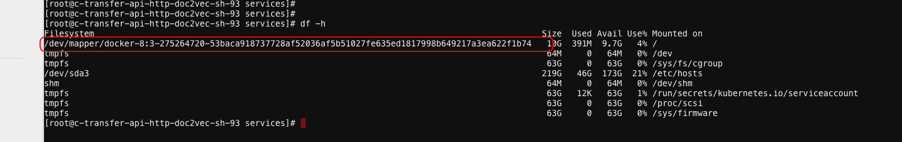

技术002K生产TroubleMaking

技术002K生产TroubleMaking
=========================

-  `技术002K生产TroubleMaking <>`__

线上问题排查记录

1.  k8s连接docker超时Timeout trying to communicate with docker during
    initialization, will retryAug 17 19:32:55 103-35-33-sh-100-C03
    dockerd: http: Accept error: accept unix /var/run/docker.sock:
    accept4: too many open files; retrying in
    1sA：无法重启docker，只能重启机器了

2.  通过强制删除Pod时（–grace-period=0
    –force），注意可能会导致该pod中的容器一直存在物理机上，因此，需要登录到物理机上强制通过docker命令删除掉，但是删除掉这个命令后，如果重新调度到该机器上，会出现问题，因此，通过crictl来删除试试。很可能程序处于D状态卡死了，重启系统。详见文章：Docker
    stop或者Docker
    kill为何不能停止容器 https://mp.weixin.qq.com/s/eZCi73pOFq0sSoMYSVujZw

3.  无法部署新的pod和删除pod解决办法：将node不可调度，然后重启docker即可

4.  Readiness probe errored: rpc error: code = DeadlineExceeded desc =
    context deadline exceeded[10.126.53.8 docker://18.6.1
    3.10.0-327.el7.x86_64]err：Type:Warning Reason:Unhealthy
    Message:Readiness probe errored: rpc error: code = DeadlineExceeded
    desc = context deadline exceeded Type:Warning Reason:Unhealthy
    Message:Readiness probe failed: cannot exec in a stopped state:
    unknown containers with unready status:
    [serving-stgy-rcmdassy-master-132-image] [10.126.53.16
    docker://18.6.1 3.10.0-327.el7.x86_64]-0/130 nodes are available: 1
    node(s) were not ready, 1 node(s) were out of disk space, 14
    Insufficient memory, 31 Insufficient cpu, 97 node(s) didn’t match
    node selector.Readiness probe failed: grpc: the client connection is
    closing: unknown57a62e0c054bfa98677c0016ee1f8 ‘sh
    /home/services/panda/bin/check_port_and_done.sh 7060’ from runtime
    service failed: rpc error: code = DeadlineExceeded desc = context
    deadline
    exceeded好几个服务出现这样的问题，将机器内核从3.10.0-327.el7.x86_64升级至3.10.0-957.el7.x86_64即可。

5.  机器的磁盘空间无法释放。重启机器。

6.  devops.transfer-api-http-doc2vec该服务只用了0.5个CPU，当CPU使用率到达70%，开始出现了502响应7.
    20190903发现物理机的实例和k8s的实例的nginx权重总是一样的，物理机的qps老是降不下来，后来才发现用8台nginx集群中，有一半机器上面的默认路由不存在，无法和容器IP通信，后来添加上默认路由问题就解决了

7.  一个nodejs的服务，分配了一个CPU，在望京机房可以启动，但是在沙河机房启动不了，必须分配8C才能启动。因为程序默认获取系统的CPU，沙河版本是1.11，lxcfs没有起作用，望京版本是1.13.5，lxcfs起作用了，因此，在程序中显式指定程序使用的CPU核数即可。

8.  core-dns有问题，没起来解决方案：镜像拉取不了，镜像地址
    gcr.io/google_containers/k8s-dns-kube-dns-amd64:1.14.1

9.  etcd宕机了解决方案：etcd重启

10. coredns宕了，镜像拉不下来，重启不了

11. calico网络不通解决方案：以下3个网段必须一样kube-apiserver:
    –pod-network-cidrkube-proxy: –cluster-cidrkube-controller-manager:
    –cluster-cidr

12. 在一台物理机上所有的docker容器磁盘大小都是10G解决方案：10.103.32.157,容器中所有的磁盘空间都是10G\ |image0|

docker的配置文件cat daemon.json

::

   {    "authorization-plugins": [],    "data-root": "",    "dns": [],    "dns-opts": [],    "dns-search": [],    "exec-opts": [],    "exec-root": "",    "experimental": false,    "storage-driver": "devicemapper",    "labels": [],    "live-restore": true,    "log-driver": "",    "log-opts": {},    "mtu": 0,    "pidfile": "",    "cluster-store": "",    "cluster-store-opts": {},    "cluster-advertise": "",    "max-concurrent-downloads": 3,    "max-concurrent-uploads": 5,    "default-shm-size": "64M",    "shutdown-timeout": 15,    "debug": false,    "hosts": [],    "log-level": "",    "swarm-default-advertise-addr": "",    "api-cors-header": "",    "selinux-enabled": false,    "userns-remap": "",    "group": "",    "cgroup-parent": "",    "default-ulimits": {},    "init": false,    "init-path": "/usr/bin/docker-init",    "ipv6": false,    "iptables": true,    "ip-forward": false,    "ip-masq": false,    "userland-proxy": false,    "userland-proxy-path": "/usr/bin/docker-proxy",    "ip": "0.0.0.0",    "bridge": "",    "bip": "",    "fixed-cidr": "",    "fixed-cidr-v6": "",    "default-gateway": "",    "default-gateway-v6": "",    "icc": false,    "raw-logs": false,    "allow-nondistributable-artifacts": [],    "registry-mirrors": [],    "seccomp-profile": "",    "insecure-registries": [],    "no-new-privileges": false,    "default-runtime": "runc",    "oom-score-adjust": -500,    "runtimes": {}}

更改配置如下：

::

   {    "authorization-plugins": [],    "data-root": "",    "dns": [],    "dns-opts": [],    "dns-search": [],    "exec-opts": [],    "exec-root": "",    "experimental": false,    "storage-driver": "overlay2",    "storage-opts": [        "overlay2.override_kernel_check=true"    ],    "labels": [],    "live-restore": true,    "log-driver": "",    "log-opts": {},    "mtu": 0,    "pidfile": "",    "cluster-store": "",    "cluster-store-opts": {},    "cluster-advertise": "",    "max-concurrent-downloads": 3,    "max-concurrent-uploads": 5,    "default-shm-size": "64M",    "shutdown-timeout": 15,    "debug": true,    "hosts": [],    "log-level": "info",    "swarm-default-advertise-addr": "",    "api-cors-header": "",    "selinux-enabled": false,    "userns-remap": "",    "group": "",    "cgroup-parent": "",    "default-ulimits": {},    "init": false,    "init-path": "/usr/bin/docker-init",    "ipv6": false,    "iptables": true,    "ip-forward": false,    "ip-masq": false,    "userland-proxy": false,    "userland-proxy-path": "/usr/bin/docker-proxy",    "ip": "0.0.0.0",    "bridge": "",    "bip": "",    "fixed-cidr": "",    "fixed-cidr-v6": "",    "default-gateway": "",    "default-gateway-v6": "",    "icc": false,    "raw-logs": false,    "allow-nondistributable-artifacts": [],    "registry-mirrors": [],    "seccomp-profile": "",    "insecure-registries": [],    "no-new-privileges": false,    "default-runtime": "runc",    "oom-score-adjust": -500,    "runtimes": {}}

更换docker的驱动后并且重启docker即可。

%23%20%E6%8A%80%E6%9C%AF002K%E7%94%9F%E4%BA%A7TroubleMaking%0A%5BTOC%5D%0A%0A%E7%BA%BF%E4%B8%8A%E9%97%AE%E9%A2%98%E6%8E%92%E6%9F%A5%E8%AE%B0%E5%BD%95%0A1.%20k8s%E8%BF%9E%E6%8E%A5docker%E8%B6%85%E6%97%B6Timeout%20trying%20to%20communicate%20with%20docker%20during%20initialization%2C%20will%20retryAug%2017%2019%3A32%3A55%20103-35-33-sh-100-C03%20dockerd%3A%20http%3A%20Accept%20error%3A%20accept%20unix%20%2Fvar%2Frun%2Fdocker.sock%3A%20accept4%3A%20too%20many%20open%20files%3B%20retrying%20in%201sA%EF%BC%9A%E6%97%A0%E6%B3%95%E9%87%8D%E5%90%AFdocker%EF%BC%8C%E5%8F%AA%E8%83%BD%E9%87%8D%E5%90%AF%E6%9C%BA%E5%99%A8%E4%BA%86%0A2.%20%E9%80%9A%E8%BF%87%E5%BC%BA%E5%88%B6%E5%88%A0%E9%99%A4Pod%E6%97%B6%EF%BC%88–grace-period%3D0%20–force%EF%BC%89%EF%BC%8C%E6%B3%A8%E6%84%8F%E5%8F%AF%E8%83%BD%E4%BC%9A%E5%AF%BC%E8%87%B4%E8%AF%A5pod%E4%B8%AD%E7%9A%84%E5%AE%B9%E5%99%A8%E4%B8%80%E7%9B%B4%E5%AD%98%E5%9C%A8%E7%89%A9%E7%90%86%E6%9C%BA%E4%B8%8A%EF%BC%8C%E5%9B%A0%E6%AD%A4%EF%BC%8C%E9%9C%80%E8%A6%81%E7%99%BB%E5%BD%95%E5%88%B0%E7%89%A9%E7%90%86%E6%9C%BA%E4%B8%8A%E5%BC%BA%E5%88%B6%E9%80%9A%E8%BF%87docker%E5%91%BD%E4%BB%A4%E5%88%A0%E9%99%A4%E6%8E%89%EF%BC%8C%E4%BD%86%E6%98%AF%E5%88%A0%E9%99%A4%E6%8E%89%E8%BF%99%E4%B8%AA%E5%91%BD%E4%BB%A4%E5%90%8E%EF%BC%8C%E5%A6%82%E6%9E%9C%E9%87%8D%E6%96%B0%E8%B0%83%E5%BA%A6%E5%88%B0%E8%AF%A5%E6%9C%BA%E5%99%A8%E4%B8%8A%EF%BC%8C%E4%BC%9A%E5%87%BA%E7%8E%B0%E9%97%AE%E9%A2%98%EF%BC%8C%E5%9B%A0%E6%AD%A4%EF%BC%8C%E9%80%9A%E8%BF%87crictl%E6%9D%A5%E5%88%A0%E9%99%A4%E8%AF%95%E8%AF%95%E3%80%82%E5%BE%88%E5%8F%AF%E8%83%BD%E7%A8%8B%E5%BA%8F%E5%A4%84%E4%BA%8ED%E7%8A%B6%E6%80%81%E5%8D%A1%E6%AD%BB%E4%BA%86%EF%BC%8C%E9%87%8D%E5%90%AF%E7%B3%BB%E7%BB%9F%E3%80%82%E8%AF%A6%E8%A7%81%E6%96%87%E7%AB%A0%EF%BC%9ADocker%20stop%E6%88%96%E8%80%85Docker%20kill%E4%B8%BA%E4%BD%95%E4%B8%8D%E8%83%BD%E5%81%9C%E6%AD%A2%E5%AE%B9%E5%99%A8%26nbsp%3Bhttps%3A%2F%2Fmp.weixin.qq.com%2Fs%2FeZCi73pOFq0sSoMYSVujZw%0A3.%20%E6%97%A0%E6%B3%95%E9%83%A8%E7%BD%B2%E6%96%B0%E7%9A%84pod%E5%92%8C%E5%88%A0%E9%99%A4pod%E8%A7%A3%E5%86%B3%E5%8A%9E%E6%B3%95%EF%BC%9A%E5%B0%86node%E4%B8%8D%E5%8F%AF%E8%B0%83%E5%BA%A6%EF%BC%8C%E7%84%B6%E5%90%8E%E9%87%8D%E5%90%AFdocker%E5%8D%B3%E5%8F%AF%0A4.%20Readiness%20probe%20errored%3A%20rpc%20error%3A%20code%20%3D%20DeadlineExceeded%20desc%20%3D%20context%20deadline%20exceeded%5B10.126.53.8%20docker%3A%2F%2F18.6.1%203.10.0-327.el7.x86_64%5Derr%EF%BC%9AType%3AWarning%20Reason%3AUnhealthy%20Message%3AReadiness%20probe%20errored%3A%20rpc%20error%3A%20code%20%3D%20DeadlineExceeded%20desc%20%3D%20context%20deadline%20exceeded%20Type%3AWarning%20Reason%3AUnhealthy%20Message%3AReadiness%20probe%20failed%3A%20cannot%20exec%20in%20a%20stopped%20state%3A%20unknown%20containers%20with%20unready%20status%3A%20%5Bserving-stgy-rcmdassy-master-132-image%5D%20%5B10.126.53.16%20docker%3A%2F%2F18.6.1%203.10.0-327.el7.x86_64%5D-0%2F130%20nodes%20are%20available%3A%201%20node(s)%20were%20not%20ready%2C%201%20node(s)%20were%20out%20of%20disk%20space%2C%2014%20Insufficient%20memory%2C%2031%20Insufficient%20cpu%2C%2097%20node(s)%20didn’t%20match%20node%20selector.Readiness%20probe%20failed%3A%20grpc%3A%20the%20client%20connection%20is%20closing%3A%20unknown57a62e0c054bfa98677c0016ee1f8%20’sh%20%2Fhome%2Fservices%2Fpanda%2Fbin%2Fcheck_port_and_done.sh%207060’%20from%20runtime%20service%20failed%3A%20rpc%20error%3A%20code%20%3D%20DeadlineExceeded%20desc%20%3D%20context%20deadline%20exceeded%E5%A5%BD%E5%87%A0%E4%B8%AA%E6%9C%8D%E5%8A%A1%E5%87%BA%E7%8E%B0%E8%BF%99%E6%A0%B7%E7%9A%84%E9%97%AE%E9%A2%98%EF%BC%8C%E5%B0%86%E6%9C%BA%E5%99%A8%E5%86%85%E6%A0%B8%E4%BB%8E3.10.0-327.el7.x86_64%E5%8D%87%E7%BA%A7%E8%87%B33.10.0-957.el7.x86_64%E5%8D%B3%E5%8F%AF%E3%80%82%0A5.%20%E6%9C%BA%E5%99%A8%E7%9A%84%E7%A3%81%E7%9B%98%E7%A9%BA%E9%97%B4%E6%97%A0%E6%B3%95%E9%87%8A%E6%94%BE%E3%80%82%E9%87%8D%E5%90%AF%E6%9C%BA%E5%99%A8%E3%80%82%0A6.%20devops.transfer-api-http-doc2vec%E8%AF%A5%E6%9C%8D%E5%8A%A1%E5%8F%AA%E7%94%A8%E4%BA%860.5%E4%B8%AACPU%EF%BC%8C%E5%BD%93CPU%E4%BD%BF%E7%94%A8%E7%8E%87%E5%88%B0%E8%BE%BE70%25%EF%BC%8C%E5%BC%80%E5%A7%8B%E5%87%BA%E7%8E%B0%E4%BA%86502%E5%93%8D%E5%BA%947.%2020190903%E5%8F%91%E7%8E%B0%E7%89%A9%E7%90%86%E6%9C%BA%E7%9A%84%E5%AE%9E%E4%BE%8B%E5%92%8Ck8s%E7%9A%84%E5%AE%9E%E4%BE%8B%E7%9A%84nginx%E6%9D%83%E9%87%8D%E6%80%BB%E6%98%AF%E4%B8%80%E6%A0%B7%E7%9A%84%EF%BC%8C%E7%89%A9%E7%90%86%E6%9C%BA%E7%9A%84qps%E8%80%81%E6%98%AF%E9%99%8D%E4%B8%8D%E4%B8%8B%E6%9D%A5%EF%BC%8C%E5%90%8E%E6%9D%A5%E6%89%8D%E5%8F%91%E7%8E%B0%E7%94%A88%E5%8F%B0nginx%E9%9B%86%E7%BE%A4%E4%B8%AD%EF%BC%8C%E6%9C%89%E4%B8%80%E5%8D%8A%E6%9C%BA%E5%99%A8%E4%B8%8A%E9%9D%A2%E7%9A%84%E9%BB%98%E8%AE%A4%E8%B7%AF%E7%94%B1%E4%B8%8D%E5%AD%98%E5%9C%A8%EF%BC%8C%E6%97%A0%E6%B3%95%E5%92%8C%E5%AE%B9%E5%99%A8IP%E9%80%9A%E4%BF%A1%EF%BC%8C%E5%90%8E%E6%9D%A5%E6%B7%BB%E5%8A%A0%E4%B8%8A%E9%BB%98%E8%AE%A4%E8%B7%AF%E7%94%B1%E9%97%AE%E9%A2%98%E5%B0%B1%E8%A7%A3%E5%86%B3%E4%BA%86%0A%0A8.%20%E4%B8%80%E4%B8%AAnodejs%E7%9A%84%E6%9C%8D%E5%8A%A1%EF%BC%8C%E5%88%86%E9%85%8D%E4%BA%86%E4%B8%80%E4%B8%AACPU%EF%BC%8C%E5%9C%A8%E6%9C%9B%E4%BA%AC%E6%9C%BA%E6%88%BF%E5%8F%AF%E4%BB%A5%E5%90%AF%E5%8A%A8%EF%BC%8C%E4%BD%86%E6%98%AF%E5%9C%A8%E6%B2%99%E6%B2%B3%E6%9C%BA%E6%88%BF%E5%90%AF%E5%8A%A8%E4%B8%8D%E4%BA%86%EF%BC%8C%E5%BF%85%E9%A1%BB%E5%88%86%E9%85%8D8C%E6%89%8D%E8%83%BD%E5%90%AF%E5%8A%A8%E3%80%82%E5%9B%A0%E4%B8%BA%E7%A8%8B%E5%BA%8F%E9%BB%98%E8%AE%A4%E8%8E%B7%E5%8F%96%E7%B3%BB%E7%BB%9F%E7%9A%84CPU%EF%BC%8C%E6%B2%99%E6%B2%B3%E7%89%88%E6%9C%AC%E6%98%AF1.11%EF%BC%8Clxcfs%E6%B2%A1%E6%9C%89%E8%B5%B7%E4%BD%9C%E7%94%A8%EF%BC%8C%E6%9C%9B%E4%BA%AC%E7%89%88%E6%9C%AC%E6%98%AF1.13.5%EF%BC%8Clxcfs%E8%B5%B7%E4%BD%9C%E7%94%A8%E4%BA%86%EF%BC%8C%E5%9B%A0%E6%AD%A4%EF%BC%8C%E5%9C%A8%E7%A8%8B%E5%BA%8F%E4%B8%AD%E6%98%BE%E5%BC%8F%E6%8C%87%E5%AE%9A%E7%A8%8B%E5%BA%8F%E4%BD%BF%E7%94%A8%E7%9A%84CPU%E6%A0%B8%E6%95%B0%E5%8D%B3%E5%8F%AF%E3%80%82%0A9.%20core-dns%E6%9C%89%E9%97%AE%E9%A2%98%EF%BC%8C%E6%B2%A1%E8%B5%B7%E6%9D%A5%E8%A7%A3%E5%86%B3%E6%96%B9%E6%A1%88%EF%BC%9A%E9%95%9C%E5%83%8F%E6%8B%89%E5%8F%96%E4%B8%8D%E4%BA%86%EF%BC%8C%E9%95%9C%E5%83%8F%E5%9C%B0%E5%9D%80%20gcr.io%2Fgoogle_containers%2Fk8s-dns-kube-dns-amd64%3A1.14.1%0A10.%20etcd%E5%AE%95%E6%9C%BA%E4%BA%86%E8%A7%A3%E5%86%B3%E6%96%B9%E6%A1%88%EF%BC%9Aetcd%E9%87%8D%E5%90%AF%0A11.%20coredns%E5%AE%95%E4%BA%86%EF%BC%8C%E9%95%9C%E5%83%8F%E6%8B%89%E4%B8%8D%E4%B8%8B%E6%9D%A5%EF%BC%8C%E9%87%8D%E5%90%AF%E4%B8%8D%E4%BA%86%0A12.%20calico%E7%BD%91%E7%BB%9C%E4%B8%8D%E9%80%9A%E8%A7%A3%E5%86%B3%E6%96%B9%E6%A1%88%EF%BC%9A%E4%BB%A5%E4%B8%8B3%E4%B8%AA%E7%BD%91%E6%AE%B5%E5%BF%85%E9%A1%BB%E4%B8%80%E6%A0%B7kube-apiserver%3A%20–pod-network-cidrkube-proxy%3A%20–cluster-cidrkube-controller-manager%3A%20–cluster-cidr%0A13.%20%E5%9C%A8%E4%B8%80%E5%8F%B0%E7%89%A9%E7%90%86%E6%9C%BA%E4%B8%8A%E6%89%80%E6%9C%89%E7%9A%84docker%E5%AE%B9%E5%99%A8%E7%A3%81%E7%9B%98%E5%A4%A7%E5%B0%8F%E9%83%BD%E6%98%AF10G%E8%A7%A3%E5%86%B3%E6%96%B9%E6%A1%88%EF%BC%9A10.103.32.157%2C%E5%AE%B9%E5%99%A8%E4%B8%AD%E6%89%80%E6%9C%89%E7%9A%84%E7%A3%81%E7%9B%98%E7%A9%BA%E9%97%B4%E9%83%BD%E6%98%AF10G!%5B1b85b96ea5c72e02af4d043bd2e82bf4.png%5D(evernotecid%3A%2F%2F48E6E93E-A436-4E8F-9B4B-205CB9D86842%2Fappyinxiangcom%2F23555478%2FENResource%2Fp1104)%0Adocker%E7%9A%84%E9%85%8D%E7%BD%AE%E6%96%87%E4%BB%B6cat%20daemon.json%0A%60%60%60%0A%7B%26nbsp%3B%26nbsp%3B%26nbsp%3B%26nbsp%3B%22authorization-plugins%22%3A%20%5B%5D%2C%26nbsp%3B%26nbsp%3B%26nbsp%3B%26nbsp%3B%22data-root%22%3A%20%22%22%2C%26nbsp%3B%26nbsp%3B%26nbsp%3B%26nbsp%3B%22dns%22%3A%20%5B%5D%2C%26nbsp%3B%26nbsp%3B%26nbsp%3B%26nbsp%3B%22dns-opts%22%3A%20%5B%5D%2C%26nbsp%3B%26nbsp%3B%26nbsp%3B%26nbsp%3B%22dns-search%22%3A%20%5B%5D%2C%26nbsp%3B%26nbsp%3B%26nbsp%3B%26nbsp%3B%22exec-opts%22%3A%20%5B%5D%2C%26nbsp%3B%26nbsp%3B%26nbsp%3B%26nbsp%3B%22exec-root%22%3A%20%22%22%2C%26nbsp%3B%26nbsp%3B%26nbsp%3B%26nbsp%3B%22experimental%22%3A%20false%2C%26nbsp%3B%26nbsp%3B%26nbsp%3B%26nbsp%3B%22storage-driver%22%3A%20%22devicemapper%22%2C%26nbsp%3B%26nbsp%3B%26nbsp%3B%26nbsp%3B%22labels%22%3A%20%5B%5D%2C%26nbsp%3B%26nbsp%3B%26nbsp%3B%26nbsp%3B%22live-restore%22%3A%20true%2C%26nbsp%3B%26nbsp%3B%26nbsp%3B%26nbsp%3B%22log-driver%22%3A%20%22%22%2C%26nbsp%3B%26nbsp%3B%26nbsp%3B%26nbsp%3B%22log-opts%22%3A%20%7B%7D%2C%26nbsp%3B%26nbsp%3B%26nbsp%3B%26nbsp%3B%22mtu%22%3A%200%2C%26nbsp%3B%26nbsp%3B%26nbsp%3B%26nbsp%3B%22pidfile%22%3A%20%22%22%2C%26nbsp%3B%26nbsp%3B%26nbsp%3B%26nbsp%3B%22cluster-store%22%3A%20%22%22%2C%26nbsp%3B%26nbsp%3B%26nbsp%3B%26nbsp%3B%22cluster-store-opts%22%3A%20%7B%7D%2C%26nbsp%3B%26nbsp%3B%26nbsp%3B%26nbsp%3B%22cluster-advertise%22%3A%20%22%22%2C%26nbsp%3B%26nbsp%3B%26nbsp%3B%26nbsp%3B%22max-concurrent-downloads%22%3A%203%2C%26nbsp%3B%26nbsp%3B%26nbsp%3B%26nbsp%3B%22max-concurrent-uploads%22%3A%205%2C%26nbsp%3B%26nbsp%3B%26nbsp%3B%26nbsp%3B%22default-shm-size%22%3A%20%2264M%22%2C%26nbsp%3B%26nbsp%3B%26nbsp%3B%26nbsp%3B%22shutdown-timeout%22%3A%2015%2C%26nbsp%3B%26nbsp%3B%26nbsp%3B%26nbsp%3B%22debug%22%3A%20false%2C%26nbsp%3B%26nbsp%3B%26nbsp%3B%26nbsp%3B%22hosts%22%3A%20%5B%5D%2C%26nbsp%3B%26nbsp%3B%26nbsp%3B%26nbsp%3B%22log-level%22%3A%20%22%22%2C%26nbsp%3B%26nbsp%3B%26nbsp%3B%26nbsp%3B%22swarm-default-advertise-addr%22%3A%20%22%22%2C%26nbsp%3B%26nbsp%3B%26nbsp%3B%26nbsp%3B%22api-cors-header%22%3A%20%22%22%2C%26nbsp%3B%26nbsp%3B%26nbsp%3B%26nbsp%3B%22selinux-enabled%22%3A%20false%2C%26nbsp%3B%26nbsp%3B%26nbsp%3B%26nbsp%3B%22userns-remap%22%3A%20%22%22%2C%26nbsp%3B%26nbsp%3B%26nbsp%3B%26nbsp%3B%22group%22%3A%20%22%22%2C%26nbsp%3B%26nbsp%3B%26nbsp%3B%26nbsp%3B%22cgroup-parent%22%3A%20%22%22%2C%26nbsp%3B%26nbsp%3B%26nbsp%3B%26nbsp%3B%22default-ulimits%22%3A%20%7B%7D%2C%26nbsp%3B%26nbsp%3B%26nbsp%3B%26nbsp%3B%22init%22%3A%20false%2C%26nbsp%3B%26nbsp%3B%26nbsp%3B%26nbsp%3B%22init-path%22%3A%20%22%2Fusr%2Fbin%2Fdocker-init%22%2C%26nbsp%3B%26nbsp%3B%26nbsp%3B%26nbsp%3B%22ipv6%22%3A%20false%2C%26nbsp%3B%26nbsp%3B%26nbsp%3B%26nbsp%3B%22iptables%22%3A%20true%2C%26nbsp%3B%26nbsp%3B%26nbsp%3B%26nbsp%3B%22ip-forward%22%3A%20false%2C%26nbsp%3B%26nbsp%3B%26nbsp%3B%26nbsp%3B%22ip-masq%22%3A%20false%2C%26nbsp%3B%26nbsp%3B%26nbsp%3B%26nbsp%3B%22userland-proxy%22%3A%20false%2C%26nbsp%3B%26nbsp%3B%26nbsp%3B%26nbsp%3B%22userland-proxy-path%22%3A%20%22%2Fusr%2Fbin%2Fdocker-proxy%22%2C%26nbsp%3B%26nbsp%3B%26nbsp%3B%26nbsp%3B%22ip%22%3A%20%220.0.0.0%22%2C%26nbsp%3B%26nbsp%3B%26nbsp%3B%26nbsp%3B%22bridge%22%3A%20%22%22%2C%26nbsp%3B%26nbsp%3B%26nbsp%3B%26nbsp%3B%22bip%22%3A%20%22%22%2C%26nbsp%3B%26nbsp%3B%26nbsp%3B%26nbsp%3B%22fixed-cidr%22%3A%20%22%22%2C%26nbsp%3B%26nbsp%3B%26nbsp%3B%26nbsp%3B%22fixed-cidr-v6%22%3A%20%22%22%2C%26nbsp%3B%26nbsp%3B%26nbsp%3B%26nbsp%3B%22default-gateway%22%3A%20%22%22%2C%26nbsp%3B%26nbsp%3B%26nbsp%3B%26nbsp%3B%22default-gateway-v6%22%3A%20%22%22%2C%26nbsp%3B%26nbsp%3B%26nbsp%3B%26nbsp%3B%22icc%22%3A%20false%2C%26nbsp%3B%26nbsp%3B%26nbsp%3B%26nbsp%3B%22raw-logs%22%3A%20false%2C%26nbsp%3B%26nbsp%3B%26nbsp%3B%26nbsp%3B%22allow-nondistributable-artifacts%22%3A%20%5B%5D%2C%26nbsp%3B%26nbsp%3B%26nbsp%3B%26nbsp%3B%22registry-mirrors%22%3A%20%5B%5D%2C%26nbsp%3B%26nbsp%3B%26nbsp%3B%26nbsp%3B%22seccomp-profile%22%3A%20%22%22%2C%26nbsp%3B%26nbsp%3B%26nbsp%3B%26nbsp%3B%22insecure-registries%22%3A%20%5B%5D%2C%26nbsp%3B%26nbsp%3B%26nbsp%3B%26nbsp%3B%22no-new-privileges%22%3A%20false%2C%26nbsp%3B%26nbsp%3B%26nbsp%3B%26nbsp%3B%22default-runtime%22%3A%20%22runc%22%2C%26nbsp%3B%26nbsp%3B%26nbsp%3B%26nbsp%3B%22oom-score-adjust%22%3A%20-500%2C%26nbsp%3B%26nbsp%3B%26nbsp%3B%26nbsp%3B%22runtimes%22%3A%20%7B%7D%7D%0A%60%60%60%0A%E6%9B%B4%E6%94%B9%E9%85%8D%E7%BD%AE%E5%A6%82%E4%B8%8B%EF%BC%9A%0A%60%60%60%0A%7B%26nbsp%3B%26nbsp%3B%26nbsp%3B%26nbsp%3B%22authorization-plugins%22%3A%20%5B%5D%2C%26nbsp%3B%26nbsp%3B%26nbsp%3B%26nbsp%3B%22data-root%22%3A%20%22%22%2C%26nbsp%3B%26nbsp%3B%26nbsp%3B%26nbsp%3B%22dns%22%3A%20%5B%5D%2C%26nbsp%3B%26nbsp%3B%26nbsp%3B%26nbsp%3B%22dns-opts%22%3A%20%5B%5D%2C%26nbsp%3B%26nbsp%3B%26nbsp%3B%26nbsp%3B%22dns-search%22%3A%20%5B%5D%2C%26nbsp%3B%26nbsp%3B%26nbsp%3B%26nbsp%3B%22exec-opts%22%3A%20%5B%5D%2C%26nbsp%3B%26nbsp%3B%26nbsp%3B%26nbsp%3B%22exec-root%22%3A%20%22%22%2C%26nbsp%3B%26nbsp%3B%26nbsp%3B%26nbsp%3B%22experimental%22%3A%20false%2C%26nbsp%3B%26nbsp%3B%26nbsp%3B%26nbsp%3B%22storage-driver%22%3A%20%22overlay2%22%2C%26nbsp%3B%26nbsp%3B%26nbsp%3B%26nbsp%3B%22storage-opts%22%3A%20%5B%26nbsp%3B%26nbsp%3B%26nbsp%3B%26nbsp%3B%26nbsp%3B%26nbsp%3B%26nbsp%3B%26nbsp%3B%22overlay2.override_kernel_check%3Dtrue%22%26nbsp%3B%26nbsp%3B%26nbsp%3B%26nbsp%3B%5D%2C%26nbsp%3B%26nbsp%3B%26nbsp%3B%26nbsp%3B%22labels%22%3A%20%5B%5D%2C%26nbsp%3B%26nbsp%3B%26nbsp%3B%26nbsp%3B%22live-restore%22%3A%20true%2C%26nbsp%3B%26nbsp%3B%26nbsp%3B%26nbsp%3B%22log-driver%22%3A%20%22%22%2C%26nbsp%3B%26nbsp%3B%26nbsp%3B%26nbsp%3B%22log-opts%22%3A%20%7B%7D%2C%26nbsp%3B%26nbsp%3B%26nbsp%3B%26nbsp%3B%22mtu%22%3A%200%2C%26nbsp%3B%26nbsp%3B%26nbsp%3B%26nbsp%3B%22pidfile%22%3A%20%22%22%2C%26nbsp%3B%26nbsp%3B%26nbsp%3B%26nbsp%3B%22cluster-store%22%3A%20%22%22%2C%26nbsp%3B%26nbsp%3B%26nbsp%3B%26nbsp%3B%22cluster-store-opts%22%3A%20%7B%7D%2C%26nbsp%3B%26nbsp%3B%26nbsp%3B%26nbsp%3B%22cluster-advertise%22%3A%20%22%22%2C%26nbsp%3B%26nbsp%3B%26nbsp%3B%26nbsp%3B%22max-concurrent-downloads%22%3A%203%2C%26nbsp%3B%26nbsp%3B%26nbsp%3B%26nbsp%3B%22max-concurrent-uploads%22%3A%205%2C%26nbsp%3B%26nbsp%3B%26nbsp%3B%26nbsp%3B%22default-shm-size%22%3A%20%2264M%22%2C%26nbsp%3B%26nbsp%3B%26nbsp%3B%26nbsp%3B%22shutdown-timeout%22%3A%2015%2C%26nbsp%3B%26nbsp%3B%26nbsp%3B%26nbsp%3B%22debug%22%3A%20true%2C%26nbsp%3B%26nbsp%3B%26nbsp%3B%26nbsp%3B%22hosts%22%3A%20%5B%5D%2C%26nbsp%3B%26nbsp%3B%26nbsp%3B%26nbsp%3B%22log-level%22%3A%20%22info%22%2C%26nbsp%3B%26nbsp%3B%26nbsp%3B%26nbsp%3B%22swarm-default-advertise-addr%22%3A%20%22%22%2C%26nbsp%3B%26nbsp%3B%26nbsp%3B%26nbsp%3B%22api-cors-header%22%3A%20%22%22%2C%26nbsp%3B%26nbsp%3B%26nbsp%3B%26nbsp%3B%22selinux-enabled%22%3A%20false%2C%26nbsp%3B%26nbsp%3B%26nbsp%3B%26nbsp%3B%22userns-remap%22%3A%20%22%22%2C%26nbsp%3B%26nbsp%3B%26nbsp%3B%26nbsp%3B%22group%22%3A%20%22%22%2C%26nbsp%3B%26nbsp%3B%26nbsp%3B%26nbsp%3B%22cgroup-parent%22%3A%20%22%22%2C%26nbsp%3B%26nbsp%3B%26nbsp%3B%26nbsp%3B%22default-ulimits%22%3A%20%7B%7D%2C%26nbsp%3B%26nbsp%3B%26nbsp%3B%26nbsp%3B%22init%22%3A%20false%2C%26nbsp%3B%26nbsp%3B%26nbsp%3B%26nbsp%3B%22init-path%22%3A%20%22%2Fusr%2Fbin%2Fdocker-init%22%2C%26nbsp%3B%26nbsp%3B%26nbsp%3B%26nbsp%3B%22ipv6%22%3A%20false%2C%26nbsp%3B%26nbsp%3B%26nbsp%3B%26nbsp%3B%22iptables%22%3A%20true%2C%26nbsp%3B%26nbsp%3B%26nbsp%3B%26nbsp%3B%22ip-forward%22%3A%20false%2C%26nbsp%3B%26nbsp%3B%26nbsp%3B%26nbsp%3B%22ip-masq%22%3A%20false%2C%26nbsp%3B%26nbsp%3B%26nbsp%3B%26nbsp%3B%22userland-proxy%22%3A%20false%2C%26nbsp%3B%26nbsp%3B%26nbsp%3B%26nbsp%3B%22userland-proxy-path%22%3A%20%22%2Fusr%2Fbin%2Fdocker-proxy%22%2C%26nbsp%3B%26nbsp%3B%26nbsp%3B%26nbsp%3B%22ip%22%3A%20%220.0.0.0%22%2C%26nbsp%3B%26nbsp%3B%26nbsp%3B%26nbsp%3B%22bridge%22%3A%20%22%22%2C%26nbsp%3B%26nbsp%3B%26nbsp%3B%26nbsp%3B%22bip%22%3A%20%22%22%2C%26nbsp%3B%26nbsp%3B%26nbsp%3B%26nbsp%3B%22fixed-cidr%22%3A%20%22%22%2C%26nbsp%3B%26nbsp%3B%26nbsp%3B%26nbsp%3B%22fixed-cidr-v6%22%3A%20%22%22%2C%26nbsp%3B%26nbsp%3B%26nbsp%3B%26nbsp%3B%22default-gateway%22%3A%20%22%22%2C%26nbsp%3B%26nbsp%3B%26nbsp%3B%26nbsp%3B%22default-gateway-v6%22%3A%20%22%22%2C%26nbsp%3B%26nbsp%3B%26nbsp%3B%26nbsp%3B%22icc%22%3A%20false%2C%26nbsp%3B%26nbsp%3B%26nbsp%3B%26nbsp%3B%22raw-logs%22%3A%20false%2C%26nbsp%3B%26nbsp%3B%26nbsp%3B%26nbsp%3B%22allow-nondistributable-artifacts%22%3A%20%5B%5D%2C%26nbsp%3B%26nbsp%3B%26nbsp%3B%26nbsp%3B%22registry-mirrors%22%3A%20%5B%5D%2C%26nbsp%3B%26nbsp%3B%26nbsp%3B%26nbsp%3B%22seccomp-profile%22%3A%20%22%22%2C%26nbsp%3B%26nbsp%3B%26nbsp%3B%26nbsp%3B%22insecure-registries%22%3A%20%5B%5D%2C%26nbsp%3B%26nbsp%3B%26nbsp%3B%26nbsp%3B%22no-new-privileges%22%3A%20false%2C%26nbsp%3B%26nbsp%3B%26nbsp%3B%26nbsp%3B%22default-runtime%22%3A%20%22runc%22%2C%26nbsp%3B%26nbsp%3B%26nbsp%3B%26nbsp%3B%22oom-score-adjust%22%3A%20-500%2C%26nbsp%3B%26nbsp%3B%26nbsp%3B%26nbsp%3B%22runtimes%22%3A%20%7B%7D%7D%0A%60%60%60%0A%E6%9B%B4%E6%8D%A2docker%E7%9A%84%E9%A9%B1%E5%8A%A8%E5%90%8E%E5%B9%B6%E4%B8%94%E9%87%8D%E5%90%AFdocker%E5%8D%B3%E5%8F%AF%E3%80%82

